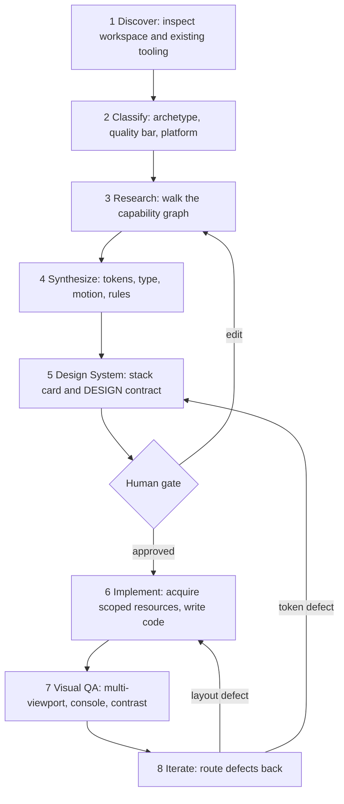

# Architecture — Orchestra 3.1.0

Orchestra is a **control plane**. Your agent is the executor.

**ORCHESTRA = CONTROL PLANE. SKILLS / MCPs / PLUGINS / LIBRARIES = CAPABILITIES. AGENTS = EXECUTORS. BRAIN = MEMORY. REGISTRY = RESOURCE KNOWLEDGE.**

The **registry** is the resource catalog. The **graph** is capability routes. Host rules and IDE customizations are adapters. They never implement a competing orchestration policy.

## The eight stages



Backend, research, and documentation tasks run the same spine with stages 4–5 collapsed into a technical plan and stage 7 replaced by tests and static analysis.

## Five subsystems

1. **Registries** (`registries/`) — machine-readable resource catalog and the capability graph, validated by JSON Schema. JSON is canonical.
2. **Engine** (`runtime/internal/engine`) — the eight-stage state machine.
3. **Acquisition adapters** (`runtime/internal/adapters/acquisition`) — npm, git, CLI, MCP, and web reference fetch. Scoped `GLOBAL` / `PROJECT` / `ON_DEMAND`. Global package installs are blocked.
4. **Host adapters** (`runtime/internal/adapters`) — keep Cursor, Antigravity, and Claude Code on one capability contract.
5. **Resource memory** — durable outcomes per resource. Only real executed jobs write rows.

## Gates

| Gate | Rule |
| --- | --- |
| Design Lab | `PREMIUM` / `EXPERIMENTAL` visual work blocks frontend writes until a stack card is approved. `STANDARD` is exempt unless requested. |
| Real-app verification | Launch and exercise the application. Source inspection is not verification. |
| Correctness review | Bugs, missing behavior, security. |
| Simplify review | Duplication, needless abstraction, dead complexity. Separate pass. |
| Evidence-first | `DONE` / `VERIFIED` / `PASSED` require observed output in the same message. |

## Resource lifecycle

```
discovered → selected → acquired → used → verified
```

Presence in a registry is not usage. A resource counts as used only when it ran and the result was checked.

## Quality bars

- `STANDARD` — efficient product work. No slop, no lab overhead.
- `PREMIUM` — multi-source research, Design Lab, visual QA, iteration.
- `EXPERIMENTAL` — 3D, shaders, WebGL, novel interaction. Always with a low-end fallback.
