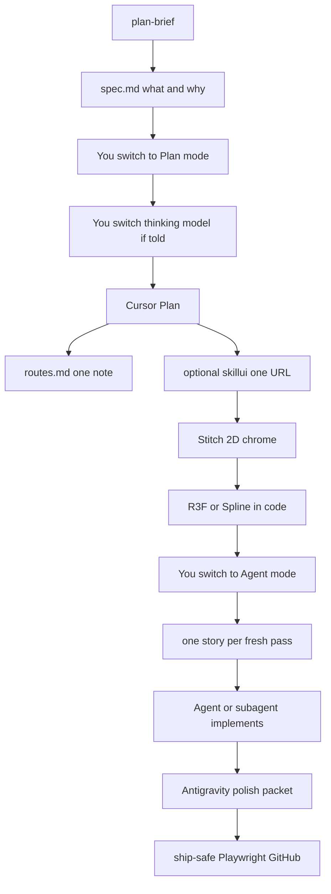

# Architecture

How this orchestra is wired. Use this repo to copy the **loop**, not someone else’s product list.

## Two remotes (on purpose)

```
author's PC: C:\projects\orchestra-brain     →  private GitHub  (full brain)
                 │
                 │  kit/sync-both.ps1 every 12 hours
                 ├─► git add/commit/push if the vault actually changed
                 └─► kit/publish-public-vault.ps1
                          copies allowlisted + overlay files
                          skips career, product briefs, secrets
                          commits the public repo only if the template changed
                          → mahik504/orchestra-workflow
```

Windows Task Scheduler task: `OrchestraBrainVaultSync` → `kit/sync-both.ps1`.

Quiet day (no file changes) = **no commit**. That is intentional. Empty commits to paint a contribution graph are not part of this workflow.

## Jump, do not scan

`routes.md` is an index: one keyword → **one** note → the repo on disk.

The AI should not open every `idea.md` “just in case.” That burns tokens and mixes products. If nothing matches, open `START HERE.md` only, then ask which product.

## Loop



```
plan-brief.md + spec.md
  → Cursor Plan mode (thinking model)
  → Stitch = 2D chrome
  → 3D in code (R3F or Spline)
  → Agent: one story per pass
  → Antigravity polish on showable web
  → ship-safe on the author's app
```

## What is never in this public repo

- Career / internship plan
- Product names, briefs, or `projects/<slug>/` notes
- `mcp_config.json`, `.env`, tokens
- Dummy logs and empty 12h commits

Overlays that strip private facts live in `kit/public-overlay/` on the **private** vault. The publish script stays there too (it must know what to block). Friends only need the files at the root of **this** clone.
