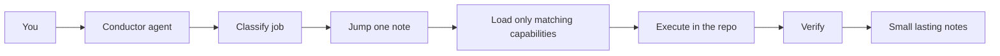
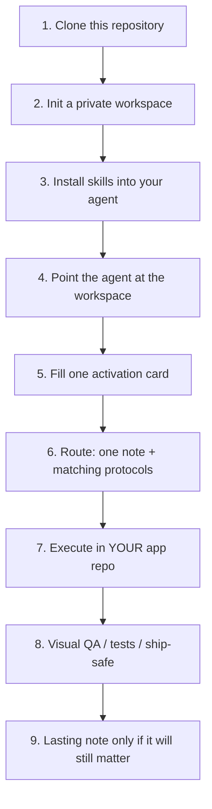
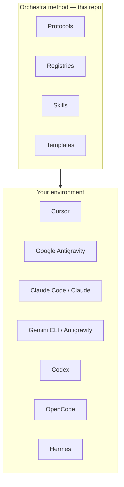
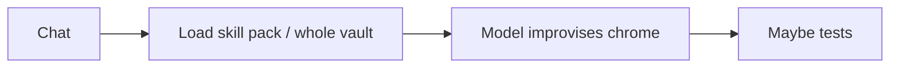
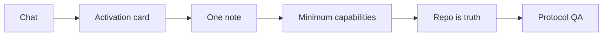
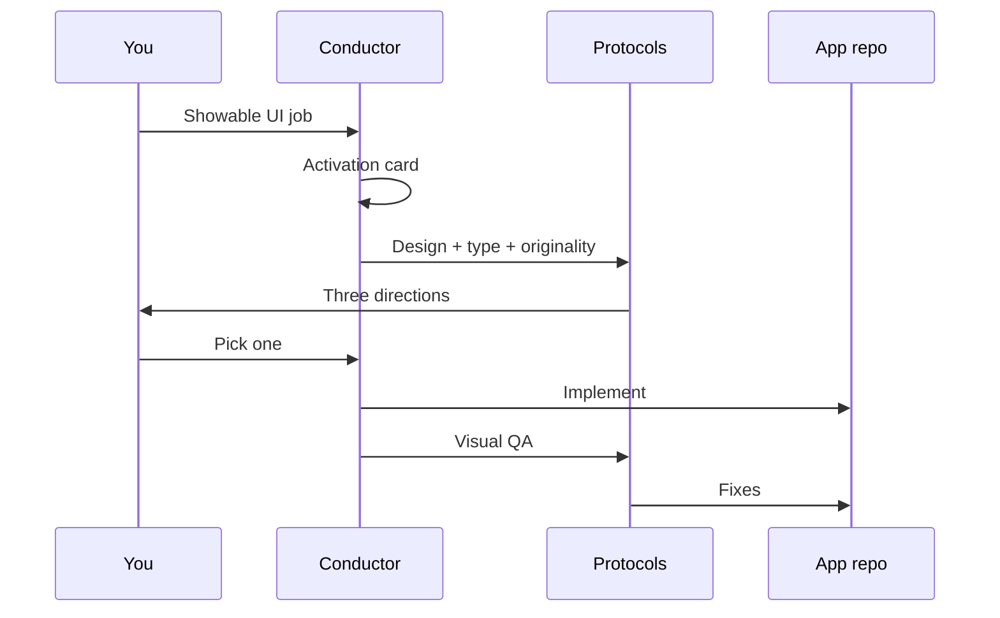

# Orchestra Workflow

**v2.0 — capability router for agentic development**

Orchestra is a reusable **orchestration methodology**: one conductor, job-scoped specialists, registries instead of skill dumps, and protocols for design, security, and verification.

It is **not** a personal second brain, not a RAG index, and not a mega-prompt that replaces model reasoning. You clone the method. You fill **your** workspace with **your** projects.

[Getting started](./docs/getting-started.md) · [Architecture](./docs/architecture.md) · [Workflow](./docs/workflow.md) · [Adapters](./docs/adapters.md) · [v1 → v2](./docs/versioning.md)



---

## What you get

| Layer | What ships in this repo | What you add privately |
| --- | --- | --- |
| Conductor | Skills + `AGENTS.md` | Your editor, your model dropdown |
| Protocols | Design, type, originality, visual QA, security, research, sensory, briefs | Your taste in `Preferences.md` |
| Registries | CORE / SPECIALIST / OPTIONAL / EXPERIMENTAL / REJECTED | Your extra rows |
| Templates | Idea, spec, design, packets, ship post | Your `projects/<slug>/` |
| Adapters | Cursor, Antigravity, Claude, Codex, Gemini, OpenCode, Hermes | Your API keys in **local** config |

**Available ≠ loaded.** A registry row is not permission to dump the pack into context.

**Repo beats vault.** Code on disk is source of truth. Notes are routing and taste.

**Jump one note.** `routes.md` → one file → the product repo. Never scan the whole workspace “just in case.”

---

## Clone → initialize → configure → activate → route → load → execute → verify



```bash
git clone https://github.com/mahik504/orchestra-workflow.git
cd orchestra-workflow
```

Windows:

```powershell
powershell -NoProfile -ExecutionPolicy Bypass -File kit/init-workspace.ps1
powershell -NoProfile -ExecutionPolicy Bypass -File kit/install-skills.ps1
```

macOS / Linux:

```bash
chmod +x kit/init-workspace.sh kit/install-skills.sh
./kit/init-workspace.sh
./kit/install-skills.sh
```

Then open **your private workspace** (default `../orchestra-workspace`) plus the **app repo you are building**. Read [docs/getting-started.md](./docs/getting-started.md). Paste `AGENTS.md` or the conductor skill into whichever agent you use.

Do **not** copy someone else’s populated brain. Init gives you empty `projects/`, empty `memory/`, and example routes.

---

## Works with the agent you already use

Orchestra is markdown skills, protocols, and registries. Any agent that can read those files can run the loop.



| Environment | Role | How Orchestra attaches |
| --- | --- | --- |
| **Cursor** | Conductor when Cursor is open | Project skills + this workspace |
| **Antigravity** | Delegated worker if Cursor is present; conductor only if Cursor is not | `kit/antigravity/` + packet |
| **Claude Code / Claude** | Conductor in that session, or hostile-review specialist | `skills/` + `AGENTS.md` |
| **Gemini** | Conductor or specialist depending on the product | Gemini skills dir + protocols |
| **Codex** | Conductor in that session | `AGENTS.md` |
| **OpenCode** | Optional adapter | Copy `skills/` into its skill path |
| **Hermes** | Optional adapter | Same markdown skills |

Orchestra does **not** merge two conductors. One session, one conductor. Specialists receive a packet and write back to the repo.

Details: [docs/adapters.md](./docs/adapters.md).

---

## Before vs after (honest)

There is **no lab A/B study** and **no “Antigravity is 30% faster” number** to cite. Anyone publishing that without a measured test is guessing. What we *can* show is how the work is structured, with counts from this template’s own inventories.

### Typical agentic IDE (before)



| Failure mode | What happens |
| --- | --- |
| Skill dump | Hundreds of skills in play; the model skims instead of routing |
| Vault dump | Every product note in context; tokens burn; worlds mix |
| Two conductors | Cursor and a second IDE both “own” the plan |
| Chrome from zero | Generic SaaS UI, default Inter, purple glow |
| “Looks good” | One screenshot in chat, no protocol |
| Always-on kits | MCP glow from 21st / Magic / Aceternity on every file |
| Fake proof | Invented stars, users, latency, accuracy |

### Orchestra v2 (after)



| Control | What changes |
| --- | --- |
| Capability router | Load conductor + 0–3 specialists for **this** job |
| Jump table | One `routes.md` hit, then the app repo |
| Single conductor | Cursor (or whichever agent is actually open) |
| Design pipeline | References → principles → original direction → tokens → UI |
| Visual QA | Playwright / browser on **your** running app |
| Registries | Five classes; REJECTED stays rejected |
| Ship-safe | Secrets in env; Strix only on **your** app |

### Template inventory (this repository, not a user study)

| Object | Count / rule | Source |
| --- | --- | --- |
| Registry classes | 5 (CORE, SPECIALIST, OPTIONAL, EXPERIMENTAL, REJECTED) | `registries/` |
| Conductor skills shipped | 5 (`orchestra-conductor`, `orchestra-vault`, `orchestra-ship`, `orchestra-docs`, `ship-safe`) | `skills/` |
| Design/security protocols | 9 in `protocols/` | this repo |
| Skill dumps refused by policy | Entire packs (e.g. ECC-scale catalogs, `vercel-labs/agent-skills --all`) | `registries/SKILL_REGISTRY.yaml` |
| Vercel skill policy | **One** audit skill (`web-design-guidelines`), never the full pack | same |
| Reverse-engineering CLI | **One** maintained tool: `npx skillui` (`amaancoderx/npxskillui`) | `registries/RESOURCE_REGISTRY.yaml` |
| Context rule | Available ≠ loaded | `docs/architecture.md` |
| High-visual gate | Activation card **before** UI | conductor skill |

If you later measure time-to-green tests or review passes in **your** team, publish *your* numbers. Do not paste fictional percentages into forks.

---

## High-visual pipeline (mandatory)



The card must record, **before chrome**:

references · reverse engineering · typography · motion · 3D/shader · visual QA · whether to packet Antigravity (or any worker)

Typography is mandatory in `DESIGN.md`. Visual QA is mandatory before “done.” Originality: extract principles (composition, type, motion, interaction, color relationships, grid, component ideas), then design **yours**. Never copy branding, assets, copy, trademarks, or source.

---

## Repository map

| Path | Purpose |
| --- | --- |
| `docs/` | Getting started, architecture, workflow, adapters, versioning |
| `protocols/` | Job-scoped operating rules |
| `registries/` | What exists vs what loads |
| `templates/` | Copy into **your** workspace |
| `skills/` | Orchestra skills (not a marketplace dump) |
| `kit/init-workspace.*` | Create an empty private workspace |
| `kit/install-skills.*` | Copy skills into local agent folders |
| `kit/antigravity/` | Antigravity adapter |
| `AGENTS.md` | Drop-in for Codex / OpenCode / Hermes / any AGENTS-aware CLI |
| `workspace-template/` | Empty brain shape (no personal projects) |

---

## What this repo will never contain

- Your (or the author’s) product briefs, career plan, or internship notes
- `.env`, API keys, MCP JSON with secrets, `mcp_config.json`
- A populated `projects/` tree
- Private vault backup logs or machine task names
- Fake metrics, fake users, contribution-graph painters

The author’s **private** vault stays private. This GitHub project is the **system**, not that vault.

---

## Version

- **v1** — Workflow notes: jump table, dual-track import, Cursor + Antigravity packets.
- **v2** (current) — Capability router, registries, design/security protocols, activation card, agent adapters, init scripts.

See [docs/versioning.md](./docs/versioning.md) and [CHANGELOG.md](./CHANGELOG.md).

## License

MIT. See [LICENSE](./LICENSE).

## Contributing

See [CONTRIBUTING.md](./CONTRIBUTING.md). Do not send secrets, private brains, or skill packs.
