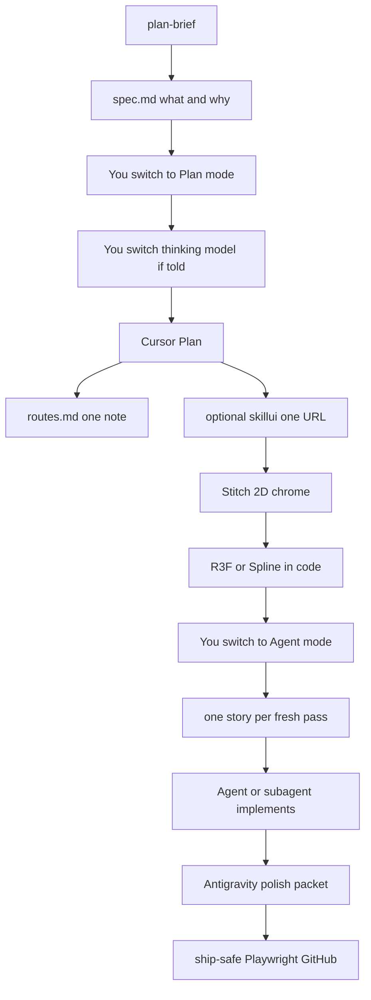

# Orchestra workflow

A **Cursor + Antigravity** loop you can copy: Plan → Stitch (2D) → code (3D in the repo) → specialists only when named.

This GitHub repo is the **public template**. It is not a dump of someone’s products, career plan, or API keys.

[Architecture](./ARCHITECTURE.md) · [Start here](./START%20HERE.md) · [Workflow](./WORKFLOW.md) · [Taste](./Preferences.md)

## Use it

1. Clone this repo (or copy `kit/antigravity/` if a friend only has Antigravity).
2. Point Cursor (or Antigravity) at the folder.
3. Read [START HERE.md](./START%20HERE.md). Jump with [routes.md](./routes.md) — one note, not the whole vault.
4. Fill [templates/plan-brief.md](./templates/plan-brief.md) before designing or coding. Plan mode writes spec.md.
5. Switch Cursor **Plan / Agent / Ask / Debug** when told. 2D chrome in Stitch. 3D in React Three Fiber or Spline. Android = Expo.

Secrets never go in the vault. Friend zip = `kit/antigravity/` only — never `mcp_config.json`.

## What is in here

| Path | What |
| --- | --- |
| `ARCHITECTURE.md` | Dual-repo idea, 12h backup, jump table |
| `WORKFLOW.md` | Who does Plan / Stitch / code / specialists |
| `Preferences.md` | Taste, motion, liked / hated |
| `CONNECT.md` | Antigravity / ChatGPT / Claude Code CLI packets |
| `STACK.md` | Skills and MCP **names** (no keys), refused tools |
| `templates/` | idea, plan-brief, spec, design, packet, ship-post |
| `kit/antigravity/` | Friend install |

Product briefs and internship notes stay on a **private** vault on the author’s machine. This clone has no `projects/<slug>/` notes. That is intended.

## License

MIT. See [LICENSE](./LICENSE).

## Contributing

This is a personal workflow template. Open an issue if a friend-install step is wrong. Do not send secrets.
