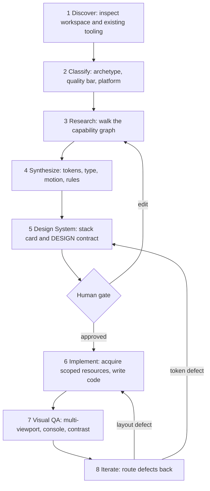

# Orchestra 3.1.0

[](https://github.com/mahik504/orchestra-workflow/actions/workflows/ci.yml)
[](https://github.com/mahik504/orchestra-workflow/actions/workflows/hygiene.yml)
[](LICENSE)
[](https://github.com/mahik504/orchestra-workflow/releases)

A control plane for agentic development. It decides *what* to build before the agent decides *how*, and it stops work a stranger will see from being designed one file at a time.

Orchestra is a **contract** (markdown your agent reads) plus an **engine** (a Go binary that enforces the parts a contract cannot). The contract works in any agent that can read markdown. The engine is optional.

```
ORCHESTRA = CONTROL PLANE
SKILLS / MCPs / PLUGINS = CAPABILITIES
AGENTS  = EXECUTORS
BRAIN   = MEMORY
REGISTRY = RESOURCE KNOWLEDGE
```

Host rules are **adapters**. They translate syntax. They do not invent a second plan or a second loop. One session, one conductor.

This repo is the **system**. It is not anyone's second brain, not a RAG index, and not a mega-prompt that replaces model reasoning. You clone the method and fill *your* workspace with *your* projects.

---

## The problem this solves

Ask three agents for three different products and you tend to get one product three times: Inter, a purple gradient, three equal cards, glass nobody asked for, motion with no purpose. Not because the models are bad — because nothing forces the *research → compare → synthesize* step, so the model reaches for its priors.

Orchestra puts a checkpoint between understanding the brief and writing frontend files. For premium work, that checkpoint is a lock.

---

## The loop

```
Understand → Classify → Search graph → Design Lab / Technical plan → HUMAN GATE
  → Implement → Verify on the real app → Correctness review → Simplify review → Remember
```

The Go engine runs the same shape as eight stages: Discover, Classify, Research, Synthesize, Design System, Implement, Visual QA, Iterate.

### Architecture



Backend, research, and documentation tasks run the same spine with stages 4–5 collapsed into a technical plan and stage 7 replaced by tests and static analysis. Full notes: [`ARCHITECTURE.md`](ARCHITECTURE.md).

**Available is not loaded.** A registry row is not permission to dump a pack into context. **Repo beats notes** — code on disk is the source of truth. **Jump one note** — `routes.md` to one file to the app repo, never a scan of the whole workspace just in case.

---

## Quality bars

| Bar | When | Design Lab |
| --- | --- | --- |
| `STANDARD` | Internal tools, fixes, glue, backend | **Off** by default. Ask to opt in. |
| `PREMIUM` | Anything a stranger will see | **On** by default. Opt out with "skip the lab". |
| `EXPERIMENTAL` | 3D, shaders, WebGL, novel interaction | **On**. Always ship a low-end fallback. |

The bar comes from the capability the brief routes to, then adjusts: work described as internal or throwaway drops to `STANDARD`; work a stranger will see rises to `PREMIUM`.

---

## The Design Lab gate

For `PREMIUM` and `EXPERIMENTAL` visual work, the engine **refuses to write files a browser renders** until a named direction is approved.

Blocked while pending: `.css`, `.scss`, `.html`, `.jsx`, `.tsx`, `.vue`, `.svelte`, `.astro`, `.glsl`, `.frag`, `.vert`, and token/theme files (`tailwind.config.*`, `theme.*`, `tokens.*`, `globals.*`).

Still writable: backend code, migrations, notes, and `DESIGN.md` — the human needs something to read before they can approve anything.

Each gate offers **2 or 3** directions. Every direction must name its typography source, its colour source, and why it picked one motion engine. Unsourced claims are refused by the API, not by convention.

Rejections are recorded with the human's stated reason and fingerprinted by the actual stack, so renaming a rejected direction and re-offering it fails. A bypass is allowed but never silent — it requires a note.

| State | Frontend writes |
| --- | --- |
| `NOT_REQUIRED` | allowed |
| `PENDING` | **blocked** |
| `APPROVED` | allowed |
| `BYPASSED` | allowed, recorded |

Full rules: [`protocols/DESIGN_LAB_PROTOCOL.md`](protocols/DESIGN_LAB_PROTOCOL.md).

Typography is mandatory in `DESIGN.md`. Visual QA is mandatory before "done." Extract principles from references — composition, type, motion, interaction, colour relationships, grid — then design yours. Never copy branding, assets, copy, trademarks, or source.

---

## Routing

`registries/design-resource-graph.json` holds 12 capability rows across 21 domains. Every row carries **both** a trigger and a skip — a capability that can only be entered and never declined is a default in disguise, and defaults are how everything ends up looking the same.

| Capability | Archetype | Bar | Risk |
| --- | --- | --- | --- |
| `premium-website` | creative_showcase | PREMIUM | 6 |
| `3d-portfolio` | spatial_experience | EXPERIMENTAL | 8 |
| `operator-hud` | mission_control | PREMIUM | 7 |
| `b2b-portal` | enterprise_portal | STANDARD | 4 |
| `academic-reader` | longform_reading | PREMIUM | 3 |
| `research-paper` | academic_writing | STANDARD | 2 |
| `micro-interactions` | interaction_design | PREMIUM | 5 |
| `physics-canvas` | gamified_canvas | EXPERIMENTAL | 7 |
| `saas-dashboard` | analytics_dashboard | STANDARD | 4 |
| `mobile-app` | mobile_experience | PREMIUM | 5 |
| `security-audit` | security_hardening | STANDARD | 1 |
| `reverse-engineering` | token_extraction | STANDARD | 2 |

The classifier scores every row against the brief and reports the ones it declined, naming the skip condition that fired. When two rows genuinely fit it asks **one** question; if nobody answers it takes the lower `risk_rank` and logs `assumed <capability>, no response`.

```
$ orchestra classify "a portfolio site that also sells prints, with an admin area for orders"

Archetype:     creative_showcase  (premium-website)
               premium-website scored 5.50 on tags: portfolio, checkout
Quality bar:   PREMIUM — default for premium-website
Design Lab:    true — PREMIUM visual work: directions must be approved before frontend files are written

[QUESTION] This reads as both "Premium Creative Website" and "B2B Enterprise Portal & SaaS".
Which is the primary job? ... if you say nothing I will assume b2b-portal, the lower-risk of the two.

Routes considered:
  [take] premium-website         5.50
  [take] b2b-portal              4.00
  [skip] 3d-portfolio            1.50  skip condition fired: The brief is a portfolio but never
                                       mentions depth, scene, or motion — route to premium-website
  [skip] saas-dashboard          0.00  no trigger condition met (score 0.00 below floor 2.00)
  ...
```

An unknown library is not forced into the nearest archetype. It is surfaced, researched, and registered as its own capability row.

---

## Evidence-first completion

**DONE / FIXED / VERIFIED / PASSED / SHIPPED** may only appear alongside observed evidence in the same message: command output, a test result, a diff, a screenshot, browser state, a CI conclusion, or git state.

Intention is not evidence. Another agent's summary is not evidence. If a step failed or was skipped, that gets said *before* any success claim.

---

## Resource discipline

Lifecycle is `discovered → selected → acquired → used → verified`. Presence in a registry is **not** usage.

Acquisition adapters in `runtime/internal/adapters/acquisition/` enforce policy:

| Adapter | Policy |
| --- | --- |
| npm | project-scoped only; `-g` and `--global` are blocked in code |
| git | pinned commit, cloned to cache |
| cli | checks `$PATH`, never installs globally |
| mcp | must appear in the approved manifest |
| web fetch | `https://` only, offline fallback cache |

Every acquisition is logged to `.orchestra/provenance.json` with source URL, version, SHA-256, and the task that justified it.

MCP state is explicit — `HEALTHY`, `OPTIONAL`, `AUTH_REQUIRED`, `BROKEN`, `DISABLED`. An unauthorized server is not "active".

30 skills stay active, synchronized across hosts. Bulk skill libraries stay quarantined on disk, and the Go runtime refuses to traverse them — including via backslash, percent-encoded, and `SKILLS~1` short-name paths. There is no `skills add --all`.

---

## Getting started

### As a method (no Go required)

```bash
git clone https://github.com/mahik504/orchestra-workflow.git
cd orchestra-workflow
```

Windows:

```powershell
powershell -NoProfile -ExecutionPolicy Bypass -File kit/bootstrap.ps1
```

macOS / Linux:

```bash
chmod +x kit/bootstrap.sh kit/init-workspace.sh
./kit/bootstrap.sh
```

Bootstrap asks which hosts to wire (Cursor, Antigravity, Claude Code, Codex/Hermes/OpenCode), creates an empty private workspace, copies the 30 skills, writes adapter files, and prints the plugin checklist. Paste your own keys in the host MCP UI. Restart. Talk.

Named references (awwwards, shadcn/ui, GSAP, R3F, Drei, …) are already in [`registries/resources.json`](registries/resources.json). Host extras are not git-cloned into someone else's Cursor account.

The Go binary is optional. Details: [docs/getting-started.md](docs/getting-started.md).

Init/bootstrap gives you an empty `projects/`, an empty `memory/`, and example routes. Do not copy someone else's populated workspace.

### With the engine

Requires Go 1.22+, Node 18+, Git 2.30+. Persist `ORCHESTRA_HOME` and install onto PATH (once):

```powershell
powershell -NoProfile -ExecutionPolicy Bypass -File kit/install-local-engine.ps1 -HomeDir "D:\work\my-orchestra"
```

```bash
cd runtime
go build -o orchestra ./cmd/orchestra

./orchestra doctor
./orchestra classify "build a reading app for arXiv papers with footnotes and math"
./orchestra plan --task "a scheduling dashboard for a school with attendance charts"
./orchestra add --intent "Add this GitHub repository to Orchestra and make it available whenever the task requires its capability. https://github.com/example/example-resource"
```

Commands: `init`, `doctor`, `classify`, `plan` (alias `route`), `run`, `verify`, `handoff`, `sync`, `memory`, `add`, `lifecycle`.

`add` inspects a URL and writes it to the Brain overlay (`memory/added-resources.json` when `ORCHESTRA_HOME` is set). It does not edit `registries/resources.json`. `lifecycle` prints the 15-step proof for one resource. Recorded outcomes update overlay routing; that is not reinforcement learning.

`plan` has no side effects. `run` executes the pipeline and honours the gate unless you pass `--auto-approve`.

### Your clone stays yours

This repository is the method: registries, graph, and the Go engine. Your private Brain is a separate workspace. Set `ORCHESTRA_HOME` to that workspace so overlay and resource memory resolve there. `orchestra doctor` prints the Memory and Overlay paths it bound.

A fresh clone without `ORCHESTRA_HOME` writes only under that clone's `.orchestra/` directory. It does not ship a live `memory/resource-memory.json`.

| Variable | Effect |
| --- | --- |
| `ORCHESTRA_HOME` | your private workspace root (Brain). Overlay and resource memory live here |
| `ORCHESTRA_MEMORY_PATH` | exact path to `resource-memory.json` |
| `ORCHESTRA_OVERLAY_PATH` | exact path to `added-resources.json` (user-added catalog) |
| `ORCHESTRA_WORKFLOW_ROOT` | where the registries live |
| `ORCHESTRA_QUARANTINE_PATH` | the bulk skill library to refuse |
| `ORCHESTRA_CONTRACT` | pin an older contract version if a rollout misbehaves |

Rollback steps: [`kit/ROLLBACK.md`](kit/ROLLBACK.md).

---

## Works with the agent you already use

| Environment | Role | How Orchestra attaches |
| --- | --- | --- |
| **Cursor** | Bulk implementation, in-file diffing, fast iteration | `.cursorrules` + project skills |
| **Antigravity** | Visual QA, architecture planning, capability synthesis | `kit/antigravity/` + packet |
| **Claude Code** | Terminal execution, backend refactor, server-side audit | `CLAUDE.md` + `skills/` |
| **Codex / OpenCode / Gemini / Hermes** | Conductor in that session | `AGENTS.md`, same markdown skills |

A host may own a capability the others lack — one has a browser MCP, another a cloud SDK. Map the capability; do not clone plugin lists between hosts. Sync means "same contract", not "same installed extras". See [docs/adapters.md](docs/adapters.md) and [kit/HOST_CAPABILITIES.md](kit/HOST_CAPABILITIES.md).

---

## Honest limits

There is **no A/B study** here, and no "30% faster" number to cite. Anyone publishing that without a measured test is guessing. What this repo can show is how the work is structured. If you measure time-to-green or review passes on your own team, publish *your* numbers — do not paste invented percentages into a fork.

Worth knowing before you rely on it:

- **Research runs offline by default.** `ResearchCoordinator` ships curated fixtures in `runtime/internal/research/sources.go` for determinism. Attribution in those fixtures names the source of the *pattern*, not a live fetch performed on your behalf. Live sources are opt-in.
- **The engine enforces structure, not taste.** It can refuse an unsourced direction and block a premature write. It cannot tell you whether a direction is good.
- **Visual QA needs a running app.** Checks at 1440×900, 768×1024, and 390×844 require the app to actually launch. Code inspection is not verification, and one screenshot in chat is not a QA pass.
- **Resource memory starts empty.** No seeded performance data — inherited numbers from someone else's machine are worse than none.

---

## What this repo will never contain

- Anyone's product briefs, career notes, or private planning
- `.env`, API keys, or MCP config with secrets
- A populated `projects/` tree
- Fake metrics, fake users, or contribution-graph painting

---

## Layout

```
AGENTS.md            the contract (Cursor + Antigravity + any AGENTS-aware CLI)
.cursorrules         Cursor adapter
CLAUDE.md            Claude Code adapter
protocols/           job-scoped rules, loaded on demand
registries/          resources.json, design-resource-graph.json, schemas
runtime/             the Go engine and CLI
skills/              the 30 active skills
kit/                 host setup, sync, rollback
docs/                getting started, workflow, adapters, portability, policy
templates/           copy into your own workspace
workspace-template/  empty workspace shape
```

---

## Overrides

Say **skip orchestra** and the contract stands down for the session. Say **skip the lab** to bypass the Design Lab for one task.

---

## License

MIT. See [LICENSE](LICENSE). Contributions: [CONTRIBUTING.md](CONTRIBUTING.md) — no secrets, no private workspaces, no skill packs.
