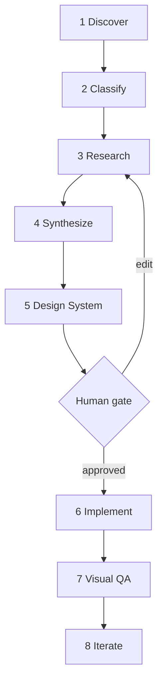
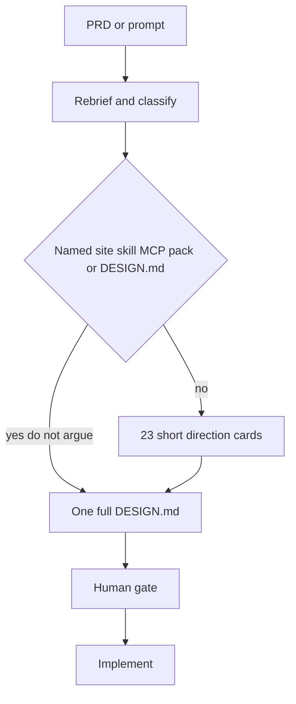
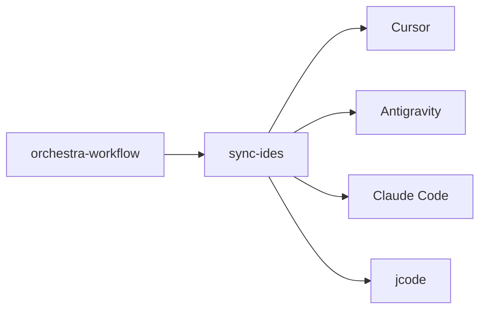
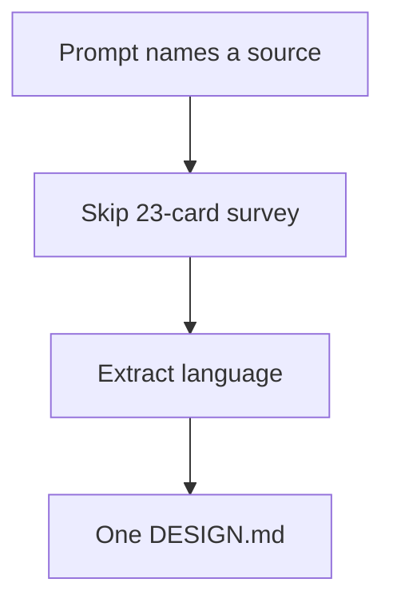
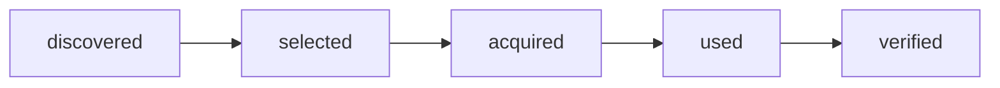
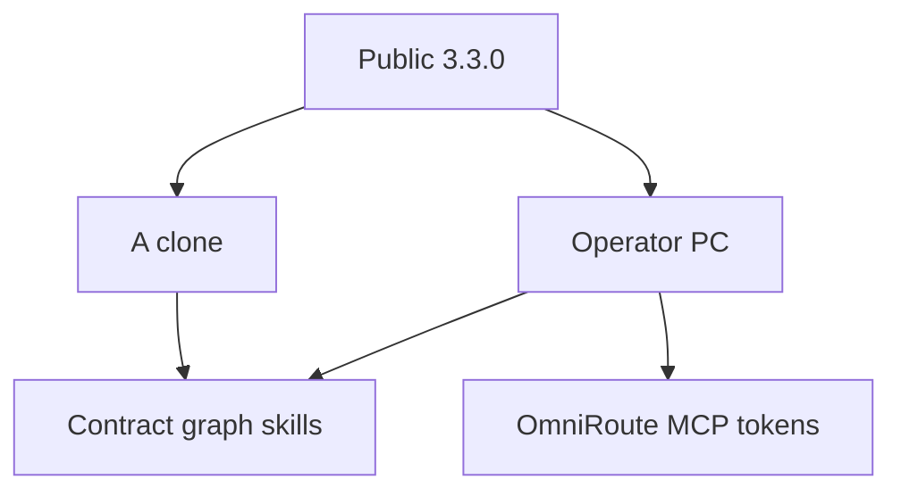

# Orchestra 3.3.0

[](https://github.com/mahik504/orchestra-workflow/actions/workflows/ci.yml)
[](https://github.com/mahik504/orchestra-workflow/actions/workflows/hygiene.yml)
[](LICENSE)
[](https://github.com/mahik504/orchestra-workflow/releases)

A control plane for agentic development. **3.3 evolves 3.2 on the same OS.** Richer catalog, four-host sync, two-stage Design Lab. Not a second conductor. Not ECC. Not “load every library every job.”

The contract stays **open**: ingest-on-update, named override, `skip orchestra`. Available ≠ loaded.

Orchestra is a **contract** (markdown your agent reads) plus an **engine** (a Go binary that enforces the parts a contract cannot). The contract works in any agent that can read markdown. The engine is optional.

```
ORCHESTRA = CONTROL PLANE
SKILLS / MCPs / PLUGINS = CAPABILITIES
AGENTS  = EXECUTORS
BRAIN   = MEMORY
REGISTRY = RESOURCE KNOWLEDGE
```

This repo is the **method**. It is not anyone's second brain. You clone it and fill *your* workspace with *your* projects. Inventory: [`docs/RESOURCE_INVENTORY.md`](docs/RESOURCE_INVENTORY.md). Extra diagrams: [`docs/diagrams/`](docs/diagrams/).

---

## 1. Control plane

Host rules are **adapters**. They translate syntax. They do not invent a second plan.

```mermaid
flowchart TD
  human[Human]
  cond[One conductor]
  graph[Capability graph]
  skills[Skills MCP libraries]
  exec[Executors]
  mem[Private Brain]
  human --> cond
  cond --> graph
  cond --> skills
  cond --> exec
  cond --> mem
```

---

## 2. The loop

```
Understand → Classify → Search graph → Design Lab / Technical plan → HUMAN GATE
  → Implement → Verify on the real app → Correctness review → Simplify review → Remember
```



Backend, research, and documentation tasks collapse stages 4–5 into a technical plan. Full notes: [`ARCHITECTURE.md`](ARCHITECTURE.md).

**Repo beats notes.** Jump `routes.md` to one file to the app repo.

---

## 3. Design Lab (two-stage)

For `PREMIUM` and `EXPERIMENTAL` visual work, the engine **refuses to write files a browser renders** until a direction is approved.



Survey cards are cheap: name, one-liner, type pairing, color world, 3D yes/no, one motion engine. Not 23 full `DESIGN.md` files. A pasted `DESIGN.md` wins. Tint: keep structure, swap one token, extend the same system.

GetLayers MCP is **`PURCHASE_PENDING`**. Do not connect it, fake it, or scrape the paid library. After you buy Full Stack lifetime, say **update**. Live checkout on 2026-09-06: Full Stack lifetime **$199** at [getlayers.ai/pricing](https://www.getlayers.ai/pricing) — re-check before you buy.

Protocol: [`protocols/DESIGN_LAB_PROTOCOL.md`](protocols/DESIGN_LAB_PROTOCOL.md).

---

## 4. Four hosts

Same contract. Different syntax. Skills copy via `kit/sync-ides.ps1`.



Auth steps only: [`docs/manual-setup/`](docs/manual-setup/). Clones do **not** get your OmniRoute tokens or `~/.claude` secrets.

College VS Code: Claude Code still reads `~/.claude/CLAUDE.md` unless that folder ships a competing file.

---

## 5. Named override

If the prompt names a website, skill, MCP, pack, or `DESIGN.md`, **that outranks the graph. Do not argue.**



---

## 6. Available ≠ loaded



~40 curated global skills. Job packs in `templates/packs/` are markdown routers, not five extra always-on skills. Bulk dumps stay quarantined. There is no `skills add --all`.

MCP states: `HEALTHY` / `OPTIONAL` / `AUTH_REQUIRED` / `BROKEN` / `DISABLED` / `PURCHASE_PENDING`.

---

## 7. Verify on the real app

```mermaid
flowchart TD
  run[Launch the app]
  click[Exercise it]
  stills[2-3 viewports]
  sos[Designer SOS]
  hall[Hallmark]
  led[Ledger]
  run --> click --> stills --> sos --> hall --> led
```

Reading the source is not verification. Intention is not evidence. No “zero errors” slogan.

---

## 8. Clone vs this machine



Rollback: tag **`v3.2.0`** and the 3.1 zip. Pin `ORCHESTRA_CONTRACT` before a git revert. [`kit/ROLLBACK.md`](kit/ROLLBACK.md).

---

## Comparison (architectural judgment, not a timed lab)

Token column = **estimated ranges** for one PREMIUM 3D marketing site, same brief. Not a measurement. Not “30% faster.”

| Host / contract | Design quality /10 | Control /10 | Token estimate 3D site | Notes |
| --- | --- | --- | --- | --- |
| Cursor raw (no Orchestra) | 4 | 2 | low–mid | Fast slop; no gate |
| Antigravity raw | 5 | 2 | mid | Better visuals, no graph |
| Orchestra 3.1.0 | 8 | 8.5 | mid–high | Gate + 12 routes |
| Orchestra 3.2.0 | 8.5 | 8.5 | mid–high | Research + SOS + ledger + jcode |
| Orchestra 3.3.0 (this) | 9 | 8.5 | high if 23 cards + one DESIGN.md; still less than 23 full DESIGN.md | Richer catalog; still one conductor |

Verification is ledger + Playwright + SOS.

---

## Quality bars

| Bar | When | Design Lab |
| --- | --- | --- |
| `STANDARD` | Internal tools, fixes, glue, backend | **Off** by default. Ask to opt in. |
| `PREMIUM` | Anything a stranger will see | **On** by default. Opt out with "skip the lab". |
| `EXPERIMENTAL` | 3D, shaders, WebGL, novel interaction | **On**. Always ship a low-end fallback. |

---

## Routing

`registries/design-resource-graph.json` holds 12 capability rows. Every row carries **both** a trigger and a skip.

| Capability | Archetype | Bar | Risk |
| --- | --- | --- | --- |
| `premium-website` | creative_showcase | PREMIUM | 6 |
| `3d-portfolio` | spatial_experience | EXPERIMENTAL | 8 |
| `operator-hud` | mission_control | PREMIUM | 7 |
| `b2b-portal` | enterprise_portal | STANDARD | 4 |
| `academic-reader` | longform_reading | PREMIUM | 3 |
| `research-paper` | academic_writing | STANDARD | 2 |
| `micro-interactions` | interaction_design | PREMIUM | 5 |
| `physics-canvas` | gamified_canvas | EXPERIMENTAL | 7 |
| `saas-dashboard` | analytics_dashboard | STANDARD | 4 |
| `mobile-app` | mobile_experience | PREMIUM | 5 |
| `security-audit` | security_hardening | STANDARD | 1 |
| `reverse-engineering` | token_extraction | STANDARD | 2 |

If the graph has no skill for the job: research with Scrapling or the web, propose **one** named capability, **wait for update**.

---

## Evidence-first completion

**DONE / FIXED / VERIFIED / PASSED / SHIPPED** may only appear alongside observed evidence in the same message.

Ledger: [`protocols/VERIFICATION_LEDGER_PROTOCOL.md`](protocols/VERIFICATION_LEDGER_PROTOCOL.md).

---

## Getting started

```bash
git clone https://github.com/mahik504/orchestra-workflow.git
cd orchestra-workflow
```

Windows:

```powershell
powershell -NoProfile -ExecutionPolicy Bypass -File kit/bootstrap.ps1
```

macOS / Linux:

```bash
chmod +x kit/bootstrap.sh kit/init-workspace.sh
./kit/bootstrap.sh
```

Bootstrap asks which hosts to wire (Cursor, Antigravity, Claude Code, Codex/Hermes/OpenCode, jcode), creates an empty private workspace, copies the allowlisted skills, writes adapter files, and prints the plugin checklist. Paste your own keys in the host MCP UI. Restart. Talk.

The Go binary is optional. Details: [docs/getting-started.md](docs/getting-started.md).

| Variable | Effect |
| --- | --- |
| `ORCHESTRA_HOME` | your private workspace root (Brain) |
| `ORCHESTRA_CONTRACT` | pin an older contract if a rollout misbehaves |

---

## Honest limits

There is **no A/B study** here. Anyone publishing “30% faster” or “zero errors” without a measured test is guessing.

- **Research runs offline by default** in the Go engine. Live sources are opt-in.
- **The engine enforces structure, not taste.**
- **Visual QA needs a running app.**
- **Resource memory starts empty.**
- **jcode is an optional executor.** Evidence (stdout) required.

---

## What this repo will never contain

- Anyone's product briefs, career notes, or private planning
- `.env`, API keys, or MCP config with secrets
- A populated `projects/` tree
- Fake metrics, fake users, or contribution-graph painting
- LinkedIn / Instagram / LeetCode scrapers or ATS auto-submit bots

---

## Layout

```
AGENTS.md            the contract
.cursorrules         Cursor adapter
CLAUDE.md            Claude Code adapter
protocols/           job-scoped rules
registries/          resources.json, graph, host-stack
runtime/             Go engine
skills/              curated global skills
kit/                 host setup, sync, rollback
docs/                getting started, inventory, diagrams, manual-setup
templates/           packets and job packs
workspace-template/  empty workspace shape
```

---

## Overrides

Say **skip orchestra** and the contract stands down for the session. Say **skip the lab** to bypass the Design Lab for one task. Plain text. Not a slash command.

---

## License

MIT. See [LICENSE](LICENSE). Contributions: [CONTRIBUTING.md](CONTRIBUTING.md) — no secrets, no private workspaces, no skill packs.
