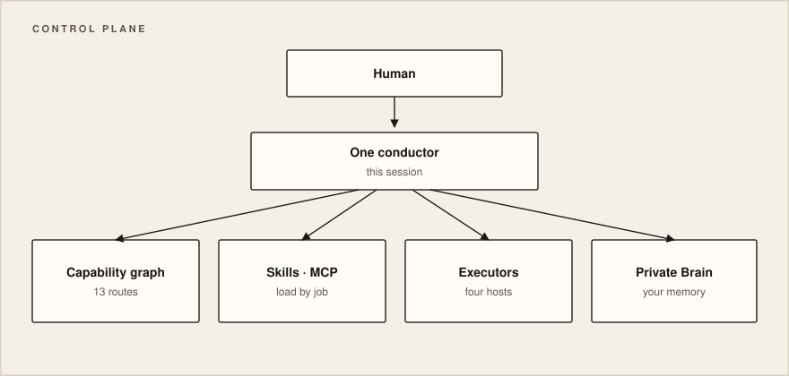
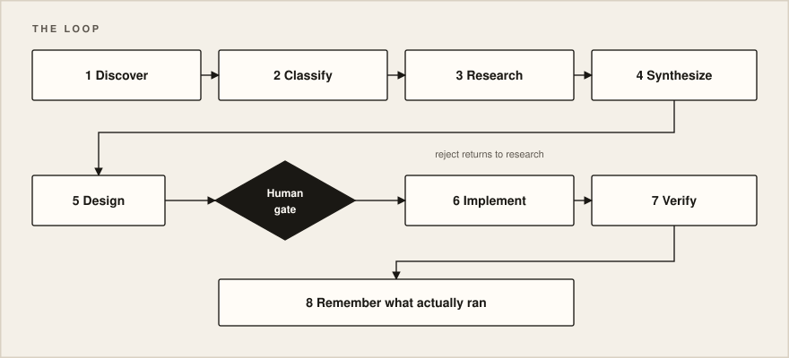
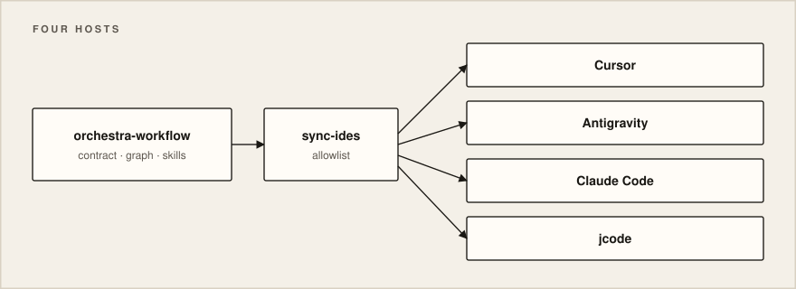

# Orchestra 3.3.1

[](https://github.com/mahik504/orchestra-workflow/actions/workflows/ci.yml)
[](https://github.com/mahik504/orchestra-workflow/actions/workflows/hygiene.yml)
[](LICENSE)
[](https://github.com/mahik504/orchestra-workflow/releases)

A **control plane for agentic development**. One conductor. Four hosts. A capability graph. A human design gate.

Orchestra is a markdown **contract** your agent already knows how to read, plus an optional **Go engine** that enforces the parts a contract cannot. Clone it. Keep products in a private workspace. This repository is the method.

```
ORCHESTRA  = CONTROL PLANE
SKILLS / MCPs / PLUGINS / LIBRARIES = CAPABILITIES
AGENTS     = EXECUTORS
BRAIN      = MEMORY
REGISTRY   = RESOURCE KNOWLEDGE
```

Available ≠ loaded. Registered ≠ active. Discovered ≠ verified.

---

## The problem

Coding agents write files quickly and choose poorly. The default is to dump every skill into the chat, collage every UI kit, skip how the product should look, and call the job done after reading source. Marketplace skill packs make that worse.

Orchestra is built for one person running serious work across Cursor, Antigravity, Claude Code, and jcode without a second conductor, a secret taste pack, or a fake “HEALTHY” label on a server nobody signed into.

---

## How it works

Host rules are **adapters**. They translate syntax. They do not invent a second plan.



The session follows one loop. Backend, research, and documentation jobs collapse the design stage into a technical plan. Visual jobs stop at the human gate before anything a browser renders is written.



```
Understand → Classify → Search graph → Design Lab / Technical plan → HUMAN GATE
  → Implement → Verify on the real app → Correctness review → Simplify review → Remember
```

The same contract is copied to four hosts. Skills come from an allowlist, not from `skills add --all`.



Named override: if the prompt names a website, skill, MCP, pack, or `DESIGN.md`, **that outranks the graph**. Do not argue. Skip the survey. Extract the language. Write one `DESIGN.md`. Tint: keep structure, swap one token, extend the same system.

Full notes: [`ARCHITECTURE.md`](ARCHITECTURE.md). Extra figures (Mermaid, for editors): [`docs/diagrams/`](docs/diagrams/).

---

## Design Lab

On `PREMIUM` and `EXPERIMENTAL` visual work, the engine **refuses to write files a browser renders** until a direction is approved.

1. Rebrief and classify.
2. If nothing is named, show **23 short direction cards** (name, one-liner, type pairing, color world, 3D yes/no, one motion engine). Not 23 full `DESIGN.md` files.
3. Write **one** sourced `DESIGN.md`. A pasted `DESIGN.md` wins.
4. Human gate. Then implement.

Protocol: [`protocols/DESIGN_LAB_PROTOCOL.md`](protocols/DESIGN_LAB_PROTOCOL.md).

GetLayers MCP is **`PURCHASE_PENDING`**. Do not connect it, fake it, or scrape the paid library. After a Full Stack lifetime purchase, say **update**. Re-check [getlayers.ai/pricing](https://www.getlayers.ai/pricing) before you buy.

---

## What 3.3.1 actually ships

| Piece | Fact |
| --- | --- |
| Contract | `AGENTS.md` plus host adapters. Visual evidence gate. Named-reference mode is 3 translations, not 23 cards. |
| Engine | Optional Go binary: classify, plan, `CONTRACT_APPROVED` then stills lock, `orchestra doctor` |
| Graph | 17 capability routes — every row has a trigger **and** a skip |
| Skills | 40 curated globals plus **four job-loaded** skills (`visual-forensics`, `visual-golden-still`, `fresh-context-review`, `final-showcase`). Packs load by job |
| Hosts | Cursor, Antigravity, Claude Code, jcode |
| Honesty | MCP states unchanged. GetLayers stays `PURCHASE_PENDING`. A `DESIGN.md` is not visual evidence |

Governance notes: [`docs/3.3.1/MIGRATION.md`](docs/3.3.1/MIGRATION.md) · [`protocols/VISUAL_GOVERNANCE.md`](protocols/VISUAL_GOVERNANCE.md)

## What 3.3.0 shipped

| Piece | Fact |
| --- | --- |
| Contract | `AGENTS.md` plus host adapters (`.cursorrules`, `CLAUDE.md`, Antigravity kit) |
| Engine | Optional Go binary: classify, plan, Design Lab lock, `orchestra doctor` |
| Graph | 13 capability routes in `registries/design-resource-graph.json` — every row has a trigger **and** a skip |
| Skills | ~40 curated globals in `registries/host-stack.json`. Job packs in `templates/packs/` load by job |
| Hosts | Cursor, Antigravity, Claude Code, jcode |
| Honesty | MCP states: `HEALTHY` / `OPTIONAL` / `AUTH_REQUIRED` / `BROKEN` / `DISABLED` / `PURCHASE_PENDING` |

| Bar | When | Design Lab |
| --- | --- | --- |
| `STANDARD` | Internal tools, fixes, glue, backend | Off unless you opt in |
| `PREMIUM` | Anything a stranger will see | On. Opt out with “skip the lab” |
| `EXPERIMENTAL` | 3D, shaders, WebGL, novel interaction | On. Ship a low-end fallback |

Capabilities: `premium-website`, `3d-portfolio`, `operator-hud`, `b2b-portal`, `academic-reader`, `research-paper`, `micro-interactions`, `physics-canvas`, `saas-dashboard`, `mobile-app`, `security-audit`, `reverse-engineering`, `interaction-components`, plus 3.3.1 `visual-forensics`, `visual-golden-still`, `fresh-context-review`, `final-showcase`.

`interaction-components` searches registered free kits for **one** control. Inspect existing project components first. It is not a skill per button library.

If the graph has no skill for the job: research a named public page, propose **one** capability, **wait for update**.

Inventory and health (no fake HEALTHY): [`docs/RESOURCE_INVENTORY.md`](docs/RESOURCE_INVENTORY.md) · [`docs/RESOURCE_HEALTH.md`](docs/RESOURCE_HEALTH.md) · [`docs/DESIGN_RESOURCE_ROUTING.md`](docs/DESIGN_RESOURCE_ROUTING.md)

### Free portion, used honestly

Use the free slice now. Do not claim a Pro MCP as free.

- **Components:** shadcn (foundation, not identity), React Bits OSS, Magic UI OSS + free MCP, Aceternity public categories, Kokonut, Motion Primitives, Cult UI, HyperUI, Tailkit public pages, 21st catalog (2 installs/day after login)
- **Research:** Godly, Land-book, Lapa Ninja, SaaSFrame, Refero public pages
- **3D:** Three.js, R3F, drei, react-postprocessing, r3f-scroll-rig — project-scoped
- **Motion:** one engine. GSAP for timelines. Do not stack every library
- **Refero MCP / Tailkit MCP:** `AUTH_REQUIRED`. Magic UI Pro, 21st Builder, Aceternity All-Access unpaid this pass

Playwright verifies **our** app. Reading the source is not verification. `DONE` / `FIXED` / `VERIFIED` / `PASSED` / `SHIPPED` only with observed evidence in the same message. Ledger: [`protocols/VERIFICATION_LEDGER_PROTOCOL.md`](protocols/VERIFICATION_LEDGER_PROTOCOL.md).

---

## Getting started

```bash
git clone https://github.com/mahik504/orchestra-workflow.git
cd orchestra-workflow
```

Windows:

```powershell
powershell -NoProfile -ExecutionPolicy Bypass -File kit/bootstrap.ps1
```

macOS / Linux:

```bash
chmod +x kit/bootstrap.sh kit/init-workspace.sh
./kit/bootstrap.sh
```

Bootstrap asks which hosts to wire, creates an empty private workspace, copies the allowlisted skills, writes adapter files, and prints the plugin checklist. Paste your own keys in the host MCP UI. Restart. Talk.

The Go binary is optional. Host auth clicks: [`docs/manual-setup/`](docs/manual-setup/). Walkthrough: [`docs/getting-started.md`](docs/getting-started.md). Rollback: pin `ORCHESTRA_CONTRACT` or check out `v3.2.0` — [`kit/ROLLBACK.md`](kit/ROLLBACK.md).

| Variable | Effect |
| --- | --- |
| `ORCHESTRA_HOME` | your private workspace root |
| `ORCHESTRA_CONTRACT` | pin an older contract if a rollout misbehaves |

Say **skip orchestra** and the contract stands down for the session. Say **skip the lab** to bypass Design Lab for one task. Plain text. Not a slash command.

---

## Contributing

This is a methodology template, not an application. Strangers clone the method and fill their own workspace.

**Useful PRs**

- Init and install script fixes
- Clearer docs and host adapters
- Registry rows with license + maintenance evidence
- Protocol clarifications that do not add skill dumps
- Go tests around classify, the Design Lab lock, and MCP honesty

**Not useful**

- Skill packs (`--all`, marketplace dumps, “88 devops skills”)
- Always-on UI-kit MCP
- Screenshot-to-code factories
- Personal brains, product briefs, or career notes
- Secrets, `.env`, MCP JSON with keys
- Fake benchmarks (“30% faster”, “zero errors”) without a described measurement

Start with [`CONTRIBUTING.md`](CONTRIBUTING.md). Open an issue for a graph miss or a resource that is documented as free when the MCP is paid.

---

## Honest limits

There is no A/B study in this repository. Token columns and quality scores without a measured test are guesses — we do not publish them.

- Research in the Go engine runs **offline by default**. Live sources are opt-in.
- The engine enforces **structure**, not taste.
- Visual QA needs a **running app**.
- Resource memory starts **empty**.
- jcode is an optional executor. Evidence is stdout.
- MCP servers you have not signed in to are `AUTH_REQUIRED`, not `HEALTHY`.
- GetLayers is purchase-pending. It is not connected.

This repo will never contain anyone’s product briefs, live keys, a populated `projects/` tree, or contribution-graph painting.

---

## Layout

```
AGENTS.md            the contract
.cursorrules         Cursor adapter
CLAUDE.md            Claude Code adapter
protocols/           job-scoped rules
registries/          resources, graph, host-stack
runtime/             Go engine
skills/              curated global skills
kit/                 host setup, sync, rollback
docs/                getting started, inventory, health, routing, diagrams
templates/           packets and job packs
workspace-template/  empty workspace shape
```

---

## License

MIT. See [LICENSE](LICENSE). Copyright (c) 2026 Mahaveer Singh Gehlot.
