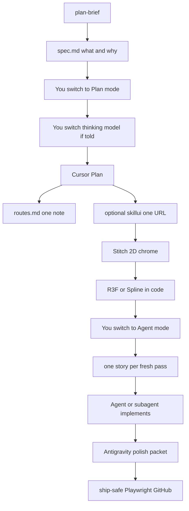

# Workflow

Global for every chat and repo until you say **skip orchestra**.

The AI in this chat **cannot** change the Cursor model dropdown or the Cursor mode (Plan / Agent / Ask / Debug / Multitask). It **must** tell you when to switch, and it **must** spawn subagents on Fable / Opus / GPT / Gemini when the job is UI, architecture, or hostile review.



```
you fill templates/plan-brief.md
  → Cursor Plan mode (thinking model) writes idea.md + spec.md
  → optional: npx skillui on ONE echo URL Plan named
  → Stitch = 2D chrome (skip only for due-now college GUI or a locked 3D fork)
  → 3D in code (R3F or Spline)
  → Agent mode: one spec story per pass (Ralph-thin). Subagents when this chat is Grok and the job is UI or review
  → Antigravity Gemini packet on showable web/Android
  → ship-safe; Playwright; GitHub as the author
```

## Cursor modes (you switch these)

| Mode | When | Not |
| --- | --- | --- |
| **Plan** | Architecture, “what next?”, filling spec.md, before Stitch or code | Implementing files |
| **Agent** | Writing code, Stitch match, tests, vault notes | Exploring a new product with no brief |
| **Ask** | Read-only questions. No edits | “Just look then secretly patch” |
| **Debug** | It broke and we need runtime evidence | Guessing without logs |
| **Multitask** | Two *independent* jobs (rare) | Two products at once |

Conductor must say the mode out loud: “Switch to Plan” / “Switch to Agent” / “Switch to Debug”. Do not stay in Agent and fake a Plan.

## Models (job, not brand)

This parent chat cannot become Opus. Spawn a Task subagent with the listed slug, **and** tell the author to switch the dropdown for the next Plan/Agent turn.

| Job | Mode | Who | Model |
| --- | --- | --- | --- |
| Architecture / spec.md | Plan | You switch dropdown | Opus / Fable / GPT 5.6 thinking |
| UI / motion / Stitch match | Agent | Subagent **and** you switch | `claude-fable-5-thinking-high` or Opus |
| Hostile backend / security | Agent after spec | Subagent | `claude-opus-5-thinking-high` (or 4.8) |
| Glue, mechanical, tests | Agent | This chat or fast subagent | Grok / `gemini-3.7-flash-high` / Kimi |
| Extra polish / CI | Antigravity | Packet | Gemini 3.7 Flash High (high quota) |
| Research | ChatGPT Go or Perplexity | Packet | Strongest available. Do not implement the repo |
| Tiny college GUI due now | Agent | This chat | Skip Stitch. Still write spec.md if it is more than a one-night hack |

If this chat is Grok and the job is UI or architecture, **do not** implement it all here. Spawn the subagent. Tell them the dropdown.

Quota dead: packet to ChatGPT Go and/or Antigravity. Same vault.

## Spec Kit (templates only — not a second conductor)

[github/spec-kit](https://github.com/github/spec-kit) is better at what/why before how. We **do not** run `specify init` or slash-command packs. That would fight Cursor Plan.

| Spec Kit phase | Orchestra |
| --- | --- |
| constitution | Preferences.md + idea.md must-not |
| specify | `templates/spec.md` → `projects/<slug>/spec.md` |
| clarify | Plan asks holes in the brief |
| plan | Cursor Plan (stack, files, order) |
| tasks | Plan todos = one story each |
| analyze | Opus subagent vs spec.md before ship |
| implement | Agent, one story per pass |
| converge | Playwright + ship-safe |

College due-now GUI may skip Stitch. It does not skip spec.md if the assignment is more than a one-night hack.

## Ralph-thin (loop + prompt, not the Ralph CLI)

[snarktank/ralph](https://github.com/snarktank/ralph) is right that **fresh context per story beats one rotting thread**. We do **not** install `ralph.sh`, Amp, or a YOLO Docker loop (second conductor, huge token burn).

Adopted:

1. Prompting = Plan + spec.md (what/why).
2. Looping = one user story per Agent/subagent pass. Story small enough for one context window.
3. Memory between passes = git + `projects/<slug>/progress.md` (learnings only).
4. Stop when stories in spec.md are checked or this round’s cap (about 8) is hit.
5. UI stories must be clickable (Playwright on **our** app).

Do not copy AGENTS.md into every repo. Learnings go in progress.md or that product’s idea.md.

## Who does which part

| Job | Use | Skills |
| --- | --- | --- |
| Idea / architecture | **Cursor Plan** | orchestra-conductor, vault |
| 2D screens / DESIGN.md | **Stitch** | stitch-*, taste-design |
| Interactive 3D | Agent + R3F or Spline | — |
| Code to match Stitch | **Cursor Agent** | impeccable, emil animate/review |
| It broke | **Cursor Debug** | — |
| Extra polish / tests / CI | **Antigravity** packet (required on showable web/Android) | same allowlist |
| Library docs | **Context7** | — |
| Click our web UI | **Playwright** | — |
| Security | **ship-safe** always; **Strix** when we scan | ship-safe, strix trio |
| Research | ChatGPT Go or Perplexity packet | — |
| Long browse until 2026-08-25 | Manus 1.6 Max packet | — |
| Hostile think box | Claude.ai or Claude Code CLI (own window) if Plan names it | — |
| Android | **Expo** | curated expo-* |

Do **not** install OpenCode, Kilo, OmniRoute, OpenHands, Dify, Langflow, Coolify, Maxun, Guildly, or the Ralph CLI **inside** Cursor or Antigravity. 3D = Three.js via R3F. shadcn and Convex are per-product if Plan names them, never a global dump.

## Read the vault (save tokens)

Do **not** read the entire vault. Jump:

1. `routes.md` (keyword → one file) or `START HERE.md` if nothing matches
2. That one `projects/<slug>/idea.md` (+ `spec.md` if it exists) on the **private** vault
3. The repo on disk

`WORKFLOW.md` / `Preferences.md` only if this job needs them. Do not paste `STACK.md` unless asked. Hiring notes stay private. Delete junk the same turn. No numbered dump folders.

## Learn (same turn)

After a like/hate, a finished task, **or a useful find**, append Preferences Liked / Hated / Thinking. Taste is allowed to change. Prefer editing existing notes. Do not file chats.

## Internet

Search when it will **actually improve** the work: current library docs, a CVE, a motion/pattern we have not used, a reference the Plan named. Do not dump trending-tool lists into the vault. If we adopt it, one line in Preferences.

## Keep the brain current

When a decision or ship happens, update that product’s `idea.md`, `memory/decisions.md`, and the START HERE map on the **private** vault.

## Surfaces

| Surface | How |
| --- | --- |
| Marketing / desktop web | React + Vite (or Next if the repo already is) |
| Android + later iOS | Expo. Play Store first. Apple later, same TS |
| 3D | Stitch does chrome. Scene = R3F or Spline. One 3D moment per screen unless Plan says more |
| Mini web game | Canvas 2D + physics unless the game *is* 3D |
| Motion refs (Framer marketplace, studios) | Echo in React Bits / CSS / R3F. Framer is not the builder |

## Hard rules

1. Fill `templates/plan-brief.md` before design or code. Then write `projects/<slug>/spec.md`.
2. No frontend until Stitch chrome is locked, except a Plan-approved 3D/game scene **or** a due-now college desktop GUI — then skip Stitch.
3. Cursor implements Stitch. It does not invent a generic SaaS look.
4. Expo for mobile until you explicitly switch.
5. Secrets never in git or the vault. `ship-safe` on every ship.
6. No skill packs. No extra MCP unless a product needs that host/db. No reminder MCP.
7. Vault: lasting notes only, under `projects/<slug>/`. Each idea has `kind`: college | personal | hiring-cv.
8. When showable: GitHub + LinkedIn. Never fake graphs. Never typo-a-day. Every new public repo gets a LICENSE the same day. Commits show the human, never an agent co-author trailer.
9. Do not run four products in parallel.
10. `npx skillui` only when Plan names one echo URL.
11. Backup is private git + `kit/sync-both.ps1` every 12h, then this public template if allowlisted files changed.
12. Installed vs refused: `STACK.md`.
