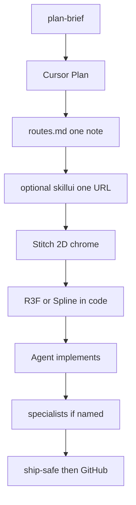

# Workflow

Global for every chat and repo until you say **skip orchestra**.

You talk. Cursor **Plan**s. You follow. Specialists only when Plan names them.



```
you fill templates/plan-brief.md (or paste those answers)
  → Cursor Plan (routes.md or START HERE → that one idea.md, not the whole vault)
  → optional: npx skillui on ONE echo URL Plan named → projects/<slug>/ref/
  → Stitch = 2D screens / app chrome
  → 3D scenes in code (R3F or Spline), not in Stitch
  → Cursor Agent implements (React Bits only for earned web motion)
  → Antigravity only if Plan said so
  → optional Claude Code CLI (separate window) only if Plan said so
  → ship-safe on your app; Strix when Docker is ready and the app is yours
```

## Read the vault (save tokens)

Do **not** read the entire vault. Jump:

1. `routes.md` (keyword → one file) or `START HERE.md` if nothing matches
2. That one `projects/<slug>/idea.md` (or Preferences if the table says so)
3. The repo on disk

Hiring notes stay in the author’s private vault. Do not invent them. `WORKFLOW.md` / `Preferences.md` only if this job needs them. Do not paste `STACK.md` unless asked. Delete junk the same turn.

## Learn (same turn)

After a like/hate, a finished task, **or a useful find**, append Preferences Liked / Hated / Thinking. Taste is allowed to change. Prefer editing existing notes. Do not file chats.

## Internet

Search when it will **actually improve** the work: current library docs, a CVE, a motion/pattern we have not used, a reference the Plan named. Do not search to fill time. Do not dump trending-tool lists into the vault. If we adopt it, one line in Preferences.

## Keep the brain current

When a decision or ship happens, update that product’s `idea.md`, `memory/decisions.md`, and the START HERE map the same turn — on the **private** vault.

## Who does which part

| Job | Use |
| --- | --- |
| Idea, architecture, stack, “what next?” | **Cursor Plan** |
| Code | **Cursor Agent** |
| It broke | **Cursor Debug** |
| 2D UI / screens / DESIGN.md | **Stitch** |
| Interactive 3D in a web/app screen | **Cursor Agent** + React Three Fiber (or Spline drop-in) |
| Extra polish / tests / CI | **Antigravity** + packet |
| Long cloud browse / wide research (until 2026-08-25) | **Manus 1.6 Max** + packet · not the conductor |
| Research | **ChatGPT** + packet |
| Hostile architecture / deep think | **Claude.ai packet** or **Claude Code CLI** (own window) · only if Plan names it |
| Security on **your** app | **ship-safe** always; **Strix** when we scan |
| Library docs | **Context7** |
| Click the running web UI | **Playwright** |
| Android (Play Store, Apple later) | **Expo (React Native)** — one TS codebase |

Do not switch the whole factory to Fable / Firebase Studio. 3D = R3F/Spline + a strong Agent model.

Do **not** install OpenCode, Kilo Code, OmniRoute, or similar **inside Cursor or Antigravity**.

## Models (pick in the tool you are in)

Use **job**, not brand.

| Job | Where | Model class |
| --- | --- | --- |
| Plan, architecture | Cursor Plan | Strongest **thinking** model in Cursor |
| Implement, 3D, UI match | Cursor Agent | Strongest Agent model |
| Mechanical refactors, tests | Cursor Agent or Antigravity | Fast / Flash |
| Extra UI polish, CI | Antigravity | Best Gemini in that tool |
| Hostile review / deep think | Claude.ai packet, or Claude Code CLI in a **separate terminal** | Opus-class · time-boxed · Plan must name it |
| Long browse / wide research | Manus 1.6 Max (until 25 Aug) | Packet only |
| Research / product | ChatGPT Go | ChatGPT’s strongest available |
| Tiny college GUI (due now) | Cursor Agent only | Skip Stitch. PySimpleGUI. Ship today |

## Surfaces

| Surface | How |
| --- | --- |
| Marketing / desktop web | React + Vite (or Next if the repo already is) |
| Android + later iOS | Expo. Play Store first. |
| 3D | Stitch does chrome. Scene = R3F or a Spline embed. One 3D moment per screen unless Plan says more. |
| Mini web game | Canvas 2D + physics unless the game *is* 3D |

## Hard rules

1. Fill `templates/plan-brief.md` before we design or code.
2. No frontend until Stitch chrome is locked, except a Plan-approved 3D/game scene **or a due-now college desktop GUI (PySimpleGUI)** — then skip Stitch.
3. Cursor implements Stitch. It does not invent a generic SaaS look.
4. Expo for mobile until you explicitly switch.
5. Secrets never in git or the vault. `ship-safe` on every ship.
6. No skill packs. No extra MCP unless a product needs that host/db.
7. Vault: lasting notes only, under `projects/<slug>/`. Each idea has `kind`: college | personal | hiring-cv.
8. When a project is showable: GitHub + LinkedIn. Never fake contribution graphs. Never typo-a-day commits.
9. Do not run four products in parallel.
10. Tool research stays in chat unless we adopt it into Preferences. `npx skillui` only when Plan names one echo URL.
11. Backup is **private git** + `kit/sync-both.ps1` every 12h, then this public template **if files changed**. Do not empty-commit for green squares.
12. Installed vs refused tools: `STACK.md`.
