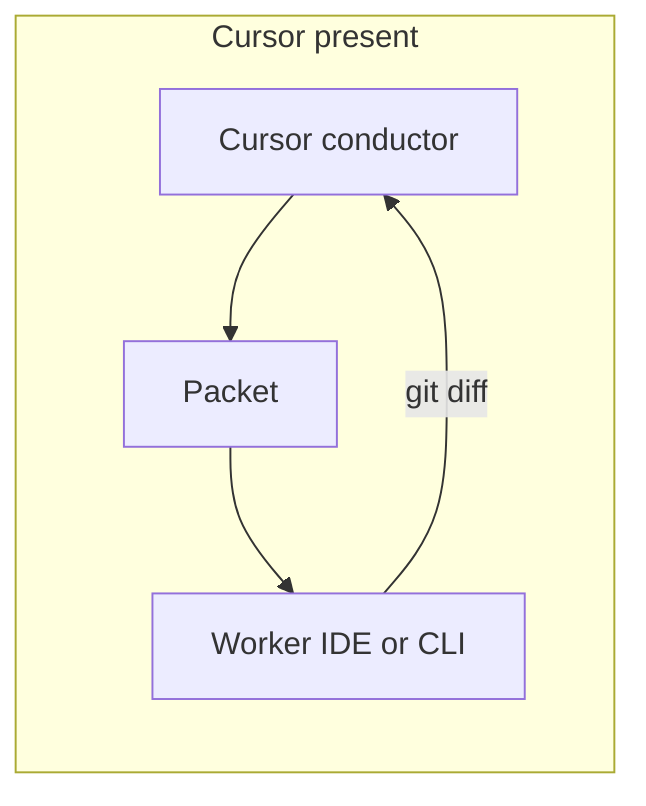

# Adapters

Orchestra is **agent-agnostic markdown**: skills, protocols, registries, templates. You attach it to the IDE or CLI you already pay for.

## Conductor vs worker

| Situation | Who conducts | Who is a worker |
| --- | --- | --- |
| Cursor is open | Cursor | Antigravity, Claude CLI, Codex, etc. only if packeted |
| Only Antigravity is open | Antigravity | — |
| Only Claude Code is open | Claude Code | — |
| Only Codex / OpenCode / Hermes is open | That CLI | — |

Never run two conductors on the same job in parallel.

Front door for a new clone: `kit/bootstrap.ps1` / `kit/bootstrap.sh` (pick hosts). That copies the 30 skills, writes adapters, and prints the plugin checklist. `kit/install-skills.*` remains for a skills-only refresh.

## Cursor

- Copy `skills/` via bootstrap or `kit/install-skills.*` into `~/.cursor/skills/`.
- Add the private workspace and the app repo to the window.
- Modes (you switch them): Plan / Agent / Ask / Debug.

## Google Antigravity

- Friend/specialist path: `kit/antigravity/`.
- Paste `kit/antigravity/MASTER-PROMPT.md` once (fill VAULT + APP ROOT).
- Prefer a packet from `templates/antigravity-packet.md`.
- If Cursor is present, Antigravity is **not** a second conductor.

## Claude / Claude Code

- Install skills into `~/.claude/skills/` (script does this if the folder exists).
- Or paste `AGENTS.md` at the repo root.
- Use as conductor **or** as a hostile-review packet from Cursor — not both at once.

## Gemini CLI / Gemini skills

- Script copies into `~/.gemini/config/skills/` when present.
- Same protocols; Gemini does not need a second vault dump.

## Codex

- Drop `AGENTS.md` into the project root (already in this repo; copy into **your app** if you want Codex to see it there).
- Codex should jump `routes.md`, not ingest the whole workflow clone.

## OpenCode

- Copy `skills/` into OpenCode’s skill directory (see its current docs).
- Orchestra still forbids installing OpenCode **inside** Cursor as a nested conductor. Using OpenCode **as** the only environment is fine.

## Hermes (and other AGENTS-compatible CLIs)

- Point the agent at `AGENTS.md` + `protocols/`.
- Same 3.1 contract and available ≠ loaded rules. Design Lab is a write lock on PREMIUM / EXPERIMENTAL visual work.

## ChatGPT / Perplexity / cloud chats

- **Packets only.** Do not connect them to a private workspace unless you explicitly choose to.
- They are not conductors for this method.

## What we will not do

- Auto-login to Google / GitHub / Vercel
- Commit MCP files with keys
- `npx skills add <org> --all`
- Install ECC, Ralph CLI, or screenshot-to-code factories
