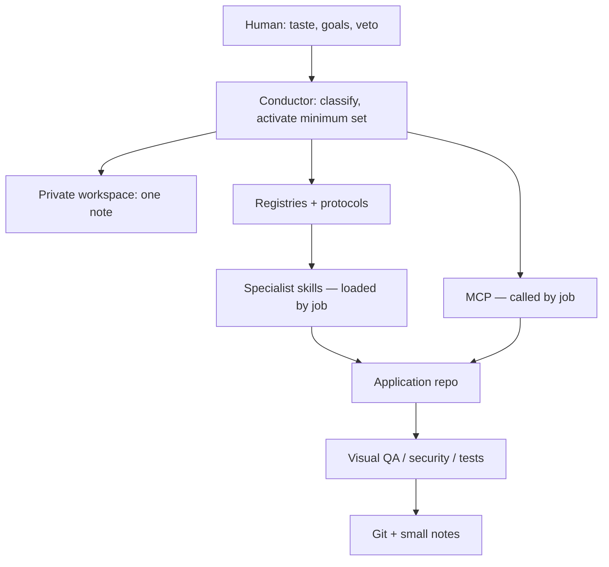

# Architecture

Orchestra v2 is a **capability router**. Quality per unit of context — not number of skills installed.

## Layers

| Layer | Role |
| --- | --- |
| 0 Human | Direction, originality, final look |
| 1 Conductor | One agent session owns the plan. Others are packets |
| 2 Private workspace | Taste, routes, product notes. **Not this GitHub repo** |
| 3 Registries | CORE / SPECIALIST / OPTIONAL / EXPERIMENTAL / REJECTED |
| 4 Protocols | How to run a class of job |
| 5 Specialists | Skills, CLIs, MCPs loaded **when the job matches** |
| 6 App repo | Source of truth for code |

## Invariants

| Rule | Meaning |
| --- | --- |
| Available ≠ loaded | Registry ≠ context dump |
| Repo beats vault | Disk/GitHub code wins over notes |
| Jump one note | `routes.md` → one file → repo |
| One conductor | No parallel “both IDEs are in charge” |
| Worker sync | Packet → worker writes repo → conductor rereads. That is **controlled git sync**, not a live daemon |
| Model still thinks | Orchestra routes and constrains; it does not replace reasoning |
| Extensible | New tools get a registry row after inspect; no pack installs |

## High-visual activation card (required before UI)

- project / platform / phase / visual ambition / risk
- capabilities ON
- skills to read **this turn**
- MCPs to **call** (not everything connected)
- model class
- references required (0–5 URLs)
- reverse engineering yes/no (`npx skillui` from `amaancoderx/npxskillui` only)
- typography ON + `TYPOGRAPHY_PROTOCOL.md`
- motion ON/OFF + engine
- 3D/shader ON/OFF + justify
- visual QA required if UI
- delegated worker yes/no + why
- artifacts expected

## What Orchestra is not

- Not a skill supermarket
- Not RAG / embeddings over your life
- Not a second product tracker
- Not “always-on Magic UI / 21st / Aceternity MCP”
- Not screenshot-to-code cloning
- Not a fake benchmark suite
