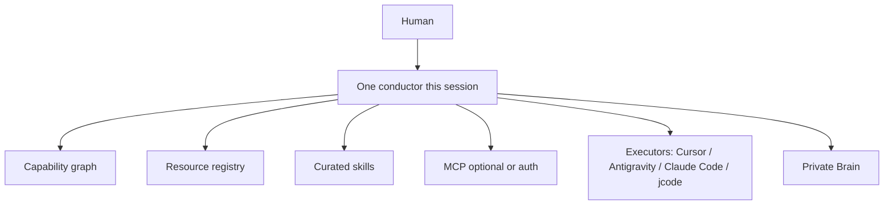

# Control plane

Orchestra is the only control plane. Skills, MCPs, plugins, and libraries are capabilities. Agents are executors. The private Brain is memory. The registry is resource knowledge.

Available ≠ loaded. Registered ≠ active. Discovered ≠ verified. Another agent's summary ≠ evidence.
