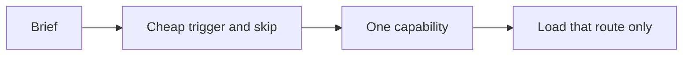

# Graph

Capability routes live in `registries/design-resource-graph.json`. Thirteen capabilities. Every row has a trigger **and** a skip.

Available ≠ loaded. A miss → research → one named capability → wait for **update**.
