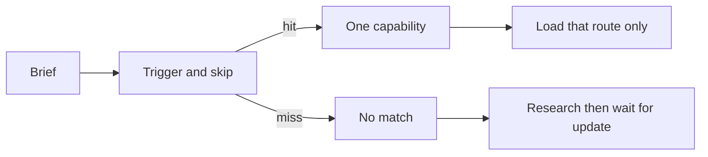

# Capability graph

Thirteen routes in `registries/design-resource-graph.json`. Every row has a trigger **and** a skip.

`interaction-components` searches registered kits for one control. It is not a skill per button library.
