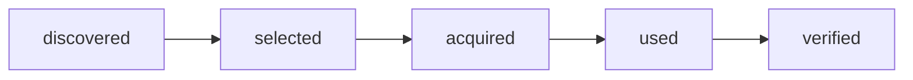

# Resource lifecycle

```mermaid
flowchart LR
  d[discovered]
  s[selected]
  a[acquired]
  u[used]
  v[verified]
  d --> s --> a --> u --> v
```

Registry presence is not usage. Do not claim a resource helped unless it ran. Provenance stays with acquired artifacts (`source`, version/commit, license, method, date, id).
