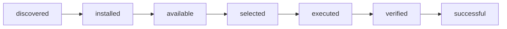

# Resource lifecycle

```mermaid
flowchart LR
  d[discovered]
  i[installed]
  a[available]
  s[selected]
  e[executed]
  v[verified]
  ok[successful]
  d --> i --> a --> s --> e --> v --> ok
```

A catalog row stays at discovered. A later stage needs a recorded run. Installed matches the older name acquired. Executed matches the older name used.
