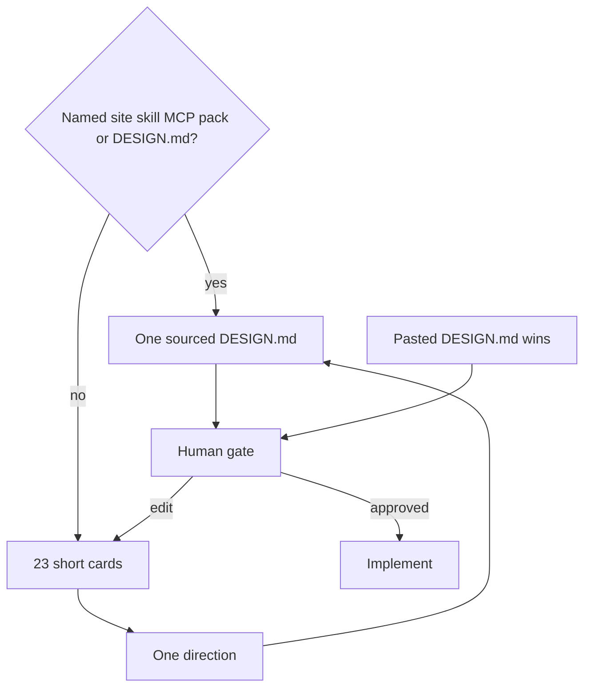

# Design Lab

Write lock on `PREMIUM` / `EXPERIMENTAL` visual work.

Tint: keep hierarchy, component grammar, spacing, interaction, shape. Replace color roles. Extend the new tokens. Do not clone trademarks or source.
