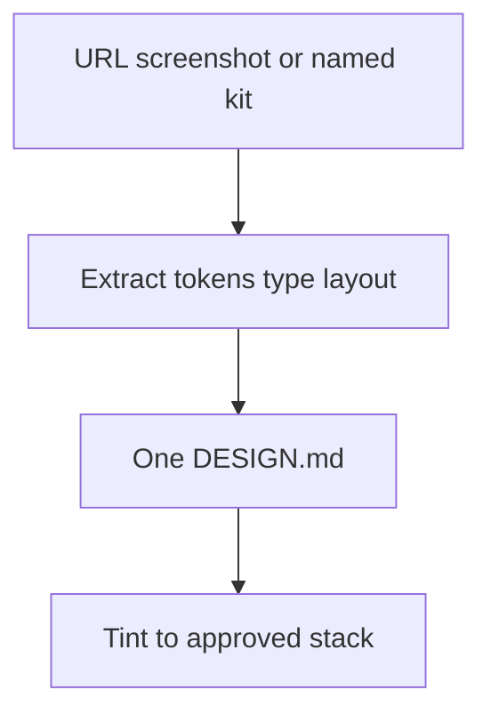

# Reverse engineering

```mermaid
flowchart TD
  src[URL screenshot or named kit]
  extract[Extract tokens type layout]
  design[One DESIGN.md]
  tint[Tint to approved stack]
  src --> extract --> design --> tint
```

Principles, not clones. GetLayers stays `PURCHASE_PENDING` until buy + **update**.
