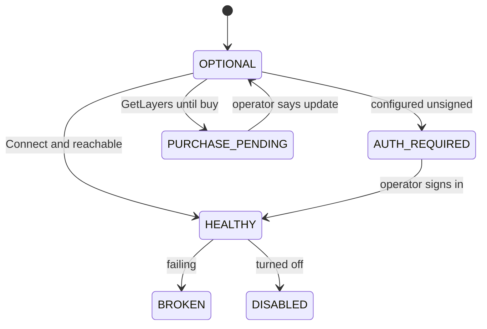

# MCP states

```mermaid
stateDiagram-v2
  [*] --> OPTIONAL
  OPTIONAL --> HEALTHY: Connect and reachable
  OPTIONAL --> AUTH_REQUIRED: configured unsigned
  AUTH_REQUIRED --> HEALTHY: operator signs in
  OPTIONAL --> PURCHASE_PENDING: GetLayers until buy
  PURCHASE_PENDING --> OPTIONAL: operator says update
  HEALTHY --> BROKEN: failing
  HEALTHY --> DISABLED: turned off
```

Unauthorized or unpurchased is not active.
