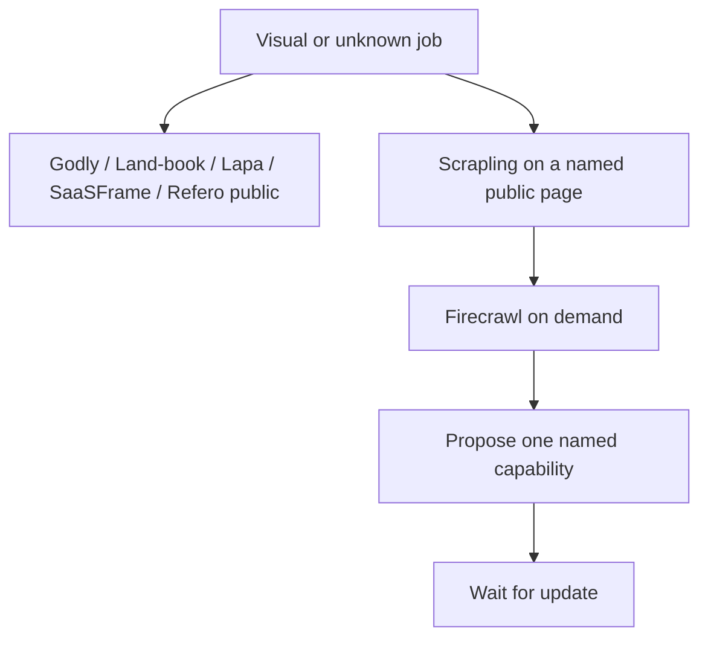

# Research layer

```mermaid
flowchart TD
  job[Visual or unknown job]
  public[Godly / Land-book / Lapa / SaaSFrame / Refero public]
  scrapling[Scrapling on a named public page]
  fire[Firecrawl on demand]
  one[Propose one named capability]
  wait[Wait for update]
  job --> public
  job --> scrapling
  scrapling --> fire --> one --> wait
```

No fake MCP for research galleries. No bulk scrape. No LinkedIn / Instagram / ATS scrapers. GetLayers stays purchase-pending.
