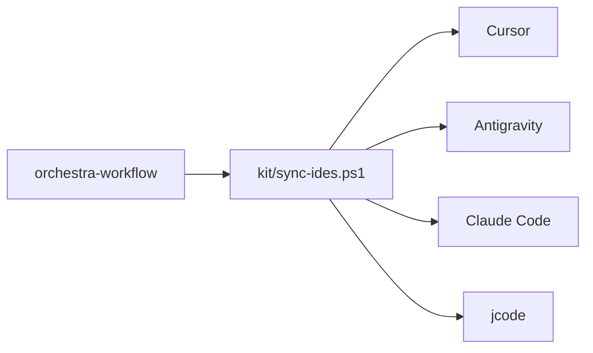

# Four hosts

One contract. Four adapters. jcode is an executor, not a second conductor.

Allowlist: `registries/host-stack.json`. Merge MCP configs; do not overwrite unrelated servers. Do not invent jcode MCP support.
