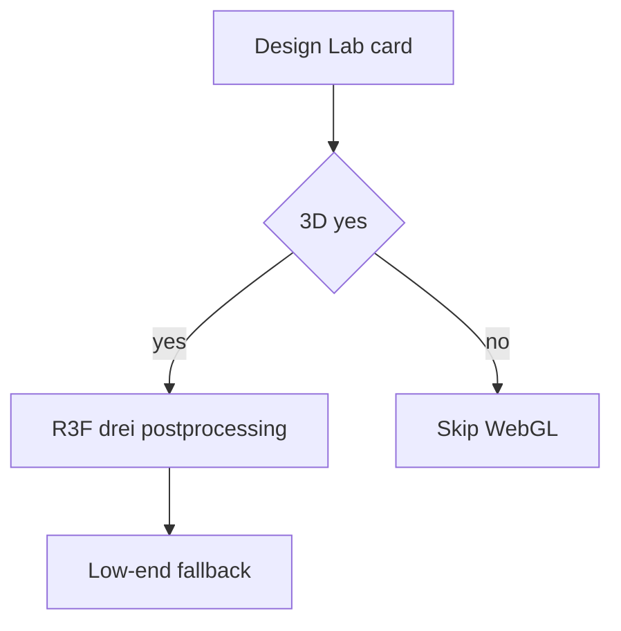

# 3D

```mermaid
flowchart TD
  card[Design Lab card]
  yes{3D yes}
  r3f[R3F drei postprocessing]
  fb[Low-end fallback]
  no[Skip WebGL]
  card --> yes
  yes -->|yes| r3f --> fb
  yes -->|no| no
```

GetLayers 3D layers wait on Full Stack purchase. 3D is a feature, not wallpaper.
