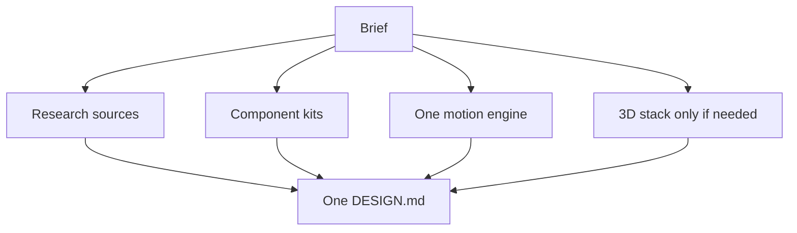

# Resource combination

Orchestra synthesizes **one** design system. It does not collage libraries.

Smallest sufficient stack: CSS/Motion primitives → React Bits / Motion Primitives → GSAP for timelines → R3F/Three/drei for 3D → postprocessing for cinematic → scroll-rig for scroll-driven 3D.

Full examples: [`docs/DESIGN_RESOURCE_ROUTING.md`](../DESIGN_RESOURCE_ROUTING.md).
