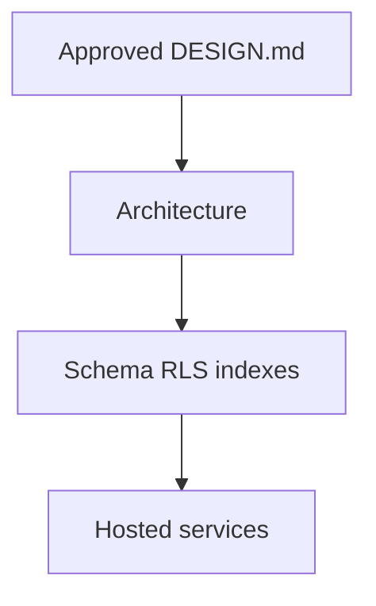

# Backend after visual contract

```mermaid
flowchart TD
  vis[Approved DESIGN.md]
  arch[Architecture]
  db[Schema RLS indexes]
  devops[Hosted services]
  vis --> arch --> db --> devops
```

Supabase / Postgres skills load when the job needs them. Secrets stay in the host. Visual contract first on PREMIUM web.
