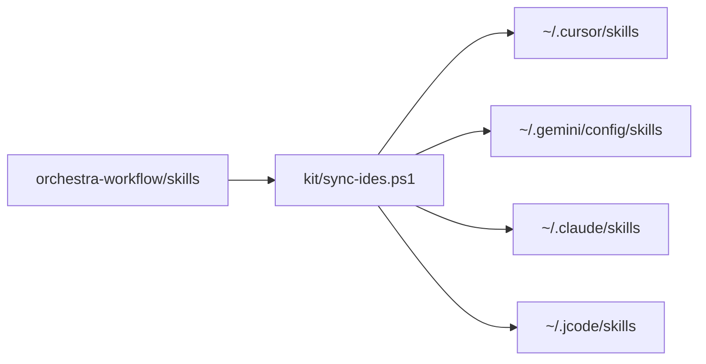

# Host sync

```mermaid
flowchart LR
  src[orchestra-workflow/skills]
  sync[kit/sync-ides.ps1]
  c[~/.cursor/skills]
  g[~/.gemini/config/skills]
  cl[~/.claude/skills]
  j[~/.jcode/skills]
  src --> sync --> c
  sync --> g
  sync --> cl
  sync --> j
```

Allowlist is `registries/host-stack.json`. Missing dest folders are skipped.
