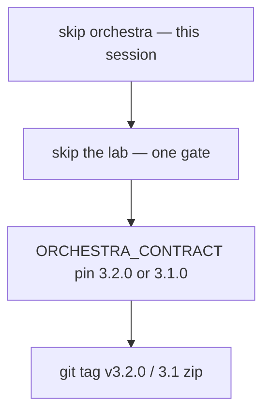

# Rollback

```mermaid
flowchart TD
  s1[skip orchestra — this session]
  s2[skip the lab — one gate]
  s3[ORCHESTRA_CONTRACT pin 3.2.0 or 3.1.0]
  s4[git tag v3.2.0 / 3.1 zip]
  s1 --> s2 --> s3 --> s4
```

Smallest first. Never force-push `main` to undo a rollout. Details: `kit/ROLLBACK.md`.
