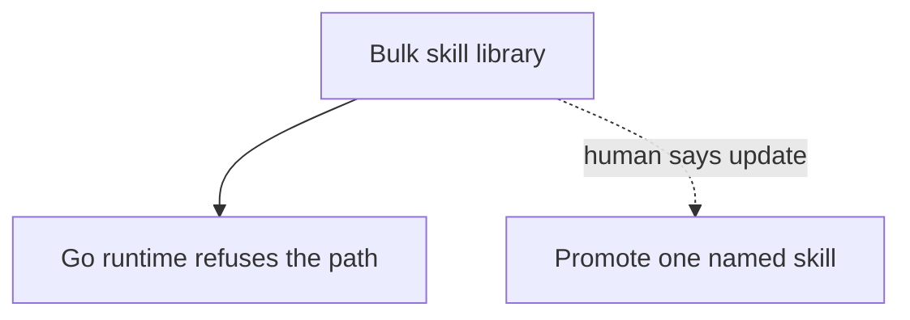

# Quarantine

```mermaid
flowchart TD
  dump[Bulk skill library]
  refuse[Go runtime refuses the path]
  one[Promote one named skill]
  dump --> refuse
  dump -.->|human says update| one
```

ECC, anthropics/skills dumps, devops-skills×88, Taste v2 pack stay out of runtime context.
