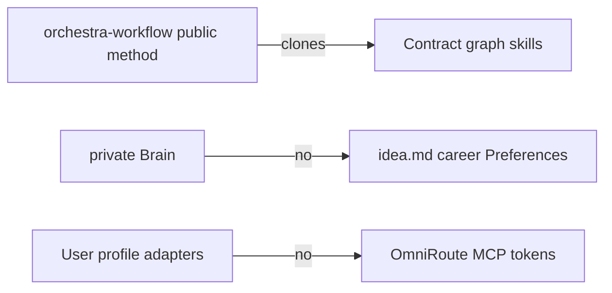

# Brain vs workflow

```mermaid
flowchart LR
  wf[orchestra-workflow public method]
  br[private Brain]
  host[User profile adapters]
  wf -->|clones| method[Contract graph skills]
  br -->|no| notes[idea.md career Preferences]
  host -->|no| secrets[OmniRoute MCP tokens]
```

Do not flip a populated Brain public.
