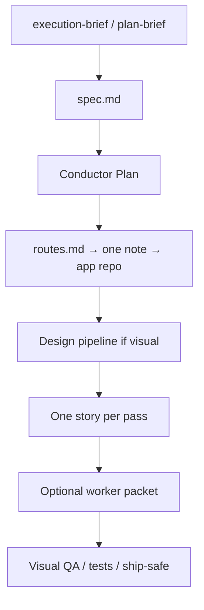

# Workflow

The conductor skill is the runtime. This page is the loop in plain language.

## Dual-track import (by `kind`)

Stitch is **optional** if the Plan already named a library, shader, or motion system. Combine that source against `design.md`.

| kind | Import | Avoid |
| --- | --- | --- |
| `college` / hackathon | One kit or SkillUI URL or React Bits or one ThreeUI piece. Tint to one world. React Bits required on hackathon web. | Five kits. Chrome from zero. |
| `hiring-cv` | Stitch + one echo **or** named library vs `design.md` | Mixing college kits into the internship story |
| `personal` operator HUD | Stitch screen 1, no shadcn/21st, one volume 3D if needed | Kit dashboards as identity |

Always-on 21st / Aceternity / Magic MCP stay **off**.

## Ralph-thin (no Ralph CLI)

After Plan: `spec.md`. One user story per agent pass. Learnings in `progress.md`. Do not install Ralph CLI, Spec Kit `specify init`, or slash-command packs.

## ECC method (not the dump)

Load-by-job and isolate plan / implement / review. Do **not** install ECC skill catalogs.

## Tokens

Jump-one-note, load-by-job, one story per pass. Short talk is fine. **Do not** shorten design or security reasoning to save tokens.

## Skip

Say **skip orchestra** to disable the router for that chat.
