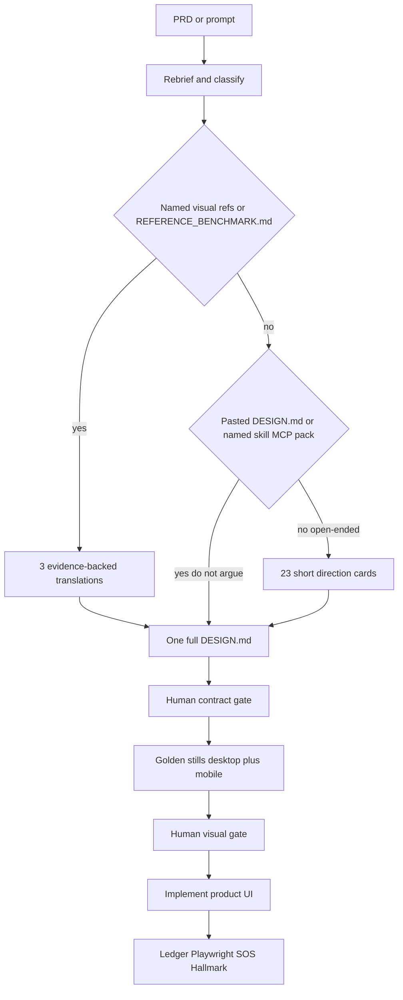

# Design Lab protocol

The Design Lab is the checkpoint between "I understood the brief" and "I started writing frontend files". Its job is to make *design-as-you-code* impossible for work a stranger will see.

The gate is a lock, not a warning. Visual governance (two locks, critics, kill switch): `VISUAL_GOVERNANCE.md`.

## When the lab runs

| Quality bar | Design Lab |
| --- | --- |
| `STANDARD` | **Off** by default. The human can opt in by asking. |
| `PREMIUM` | **On**. Opt out only if the human says "skip the lab". |
| `EXPERIMENTAL` | **On**. Always ship a low-end fallback. |

The bar comes from the capability row in `registries/design-resource-graph.json` (`quality_bar`), then from the brief.

Run `orchestra classify "<your brief>"` to see the bar, the chosen route, and every route that was declined.

## Two locks (3.3.1)

1. **Contract.** Survey or translations, then one sourced `DESIGN.md`. Human accepts LOCKED sections. State: `CONTRACT_APPROVED`. Product UI stays refused.
2. **Visual evidence.** Representative desktop still + mobile still, files on disk, human note. State: `APPROVED`. Then product UI may be written.

**A DESIGN.md is not visual evidence.**

## Survey sizes

| Mode | Cards | When |
| --- | --- | --- |
| Open-ended PREMIUM | Exactly **23** short cards | “Surprise me.” No substantial named visual reference. |
| Named-reference | Exactly **3** evidence-backed translations | Brief names a live site / screenshot recreation / “feel like X”, or `REFERENCE_BENCHMARK.md` exists. |
| Skip survey | None | **Pasted** `DESIGN.md`, or a named skill/MCP/pack that already *is* the contract. |

Each card is: id, name, one-liner, typography pairing, color world, 3D yes/no, one motion engine. Not full contracts.

`OfferSurvey` accepts 23 or 3. Anything else is refused. `OfferContract` requires the survey, the 3-card path, or a recorded skip.

Named *visual* references do **not** skip to one `DESIGN.md` and do **not** emit 23 cards. They go forensics → 3 translations → one locked contract → stills.

Tint (keep structure, swap one token): `reverse-engineering`. Not forensics. Not a clone. Not their logo or source.

## Custom DESIGN.md

If the human pastes a `DESIGN.md`, call `ApproveCustom` with who approved and a note. Gate becomes `CONTRACT_APPROVED`. Golden stills remain unpaid.

## Gate states

| State | Meaning | Product frontend writes |
| --- | --- | --- |
| `NOT_REQUIRED` | Bar or task does not call for a lab | allowed |
| `PENDING` | Survey/translations + contract owed | **blocked** |
| `CONTRACT_APPROVED` | Locked `DESIGN.md` accepted; stills unpaid | **blocked** except `.orchestra/design-lab/golden-stills/` |
| `APPROVED` | Golden stills human-approved | allowed |
| `BYPASSED` | The human waived the lab, with a recorded note | allowed |

`Cleared()` is true only for `APPROVED`, `BYPASSED`, `NOT_REQUIRED`.

A bypass is legitimate. A *silent* bypass is not — `Bypass` refuses an empty note. `SkipSurvey` also refuses an empty reason. `ApproveStills` refuses missing files or an empty note.

## What is blocked

Anything the browser renders: `.css`, `.scss`, `.sass`, `.less`, `.html`, `.jsx`, `.tsx`, `.vue`, `.svelte`, `.astro`, `.glsl`, `.frag`, `.vert`, plus token and theme files (`tailwind.config.*`, `theme.*`, `tokens.*`, `globals.*`, `design-system.*`).

Backend code, migrations, notes, `DESIGN.md`, and `REFERENCE_BENCHMARK.md` stay writable.

During `CONTRACT_APPROVED` only, files under `.orchestra/design-lab/golden-stills/` (png/webp plus a throwaway still renderer) may be written. Product `src/` / `app/` stays locked.

## What a full contract must contain

See `DESIGN_SYSTEM_PROTOCOL.md` for **LOCKED** vs **OPEN**.

LOCKED (human-approved only):

- Visual concept / world
- Type roles
- Color roles
- Motion principle
- Layout / architecture principles
- Character direction if any

OPEN until later gates (stills, implementation):

- Exact px
- Kit
- Nav mechanism
- Scene composition
- 3D yes/no implementation
- Motion implementation

Every contract still needs a **named source** for typography, colour, and why it picked one motion engine — plus the OPEN fields as intent, not as unpaid evidence.

Source tiers (name them, do not load all): shadcn only if the plan names it; React Bits for motion primitives; GetLayers MCP only after purchase; Aceternity / Cult / 21st as **one named echo**.

## Rejection is the useful half

When the human turns a **contract** down, record **their stated reason**. `Reject` refuses an empty reason.

Rejections are fingerprinted by their actual stack, not by their name. The log lives at `.orchestra/design-lab/rejected-directions.json`.

Contract approvals: `.orchestra/design-lab/approved-<task-id>.json`.
Stills: `.orchestra/design-lab/stills-<task-id>.json`.

## Overrides

- **"skip the lab"** in the brief, or `--skip-visual-gate`, waives the lab for one task.
- **"skip orchestra"** stands the whole contract down for the session.
- Plain text. Not a slash command.

The gate is a checkpoint, not a cage. The human can override the stack at any point after approval.

## Anti-slop

The lab exists because of a specific failure: research → compare → synthesize is skipped, and the model reaches for its priors. Its priors are Inter with a purple gradient, three equal cards, unmotivated glass, badge soup, motion with no purpose, and `#000000` with no chromatic depth.

Extract principles from references. Never copy branding, assets, copy, trademarks, or source.
