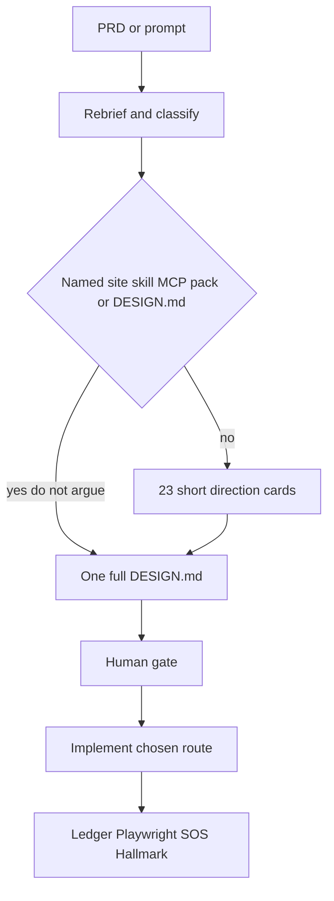

# Design Lab protocol

The Design Lab is the checkpoint between "I understood the brief" and "I started writing frontend files". Its job is to make *design-as-you-code* impossible for work a stranger will see.

The gate is a lock, not a warning. While it is `PENDING`, the engine refuses to write anything a browser renders.

## When the lab runs

| Quality bar | Design Lab |
| --- | --- |
| `STANDARD` | **Off** by default. The human can opt in by asking. |
| `PREMIUM` | **On**. Opt out only if the human says "skip the lab". |
| `EXPERIMENTAL` | **On**. Always ship a low-end fallback. |

The bar comes from the capability row in `registries/design-resource-graph.json` (`quality_bar`), then from the brief.

Run `orchestra classify "<your brief>"` to see the bar, the chosen route, and every route that was declined.

## Two stages (3.3)

1. **Survey (cheap).** Exactly **23** short cards. Each card is: id, name, one-liner, typography pairing, color world, 3D yes/no, one motion engine. Not 23 full `DESIGN.md` files.
2. **Contract.** After the human picks, write **one** full sourced `DESIGN.md`. The engine's `OfferContract` accepts a single `Direction`. Unsourced typography, colour, or motion is refused.

## Named override

If the prompt names a website, skill, MCP, pack, or `DESIGN.md`, **skip the survey**. Extract the language. One contract. Do not argue.

Tint: preserve structure, swap one token, extend the same system to new sections. Not a clone. Not their logo or source.

## Custom DESIGN.md

If the human pastes a `DESIGN.md`, call `ApproveCustom` with who approved and a note. Gate becomes `APPROVED`. Implement that file.

## Gate states

| State | Meaning | Frontend writes |
| --- | --- | --- |
| `NOT_REQUIRED` | Bar or task does not call for a lab | allowed |
| `PENDING` | Survey/contract owed, none approved | **blocked** |
| `APPROVED` | A named direction or custom DESIGN.md was approved | allowed |
| `BYPASSED` | The human waived the lab, with a recorded note | allowed |

A bypass is legitimate. A *silent* bypass is not — `Bypass` refuses an empty note. `SkipSurvey` also refuses an empty reason.

## What is blocked

Anything the browser renders: `.css`, `.scss`, `.sass`, `.less`, `.html`, `.jsx`, `.tsx`, `.vue`, `.svelte`, `.astro`, `.glsl`, `.frag`, `.vert`, plus token and theme files (`tailwind.config.*`, `theme.*`, `tokens.*`, `globals.*`, `design-system.*`).

Backend code, migrations, notes, and `DESIGN.md` itself stay writable.

## What a full contract must contain

- Visual concept and product type
- Typography — a named pairing **and where it came from**
- Colour world — **and its source**
- Layout language
- Component kit (named, or `custom`)
- **One** motion engine, **and why that one**
- 3D: yes/no, and the library if yes
- Shader: yes/no
- Logo method
- Icon system
- Implementation stack

Source tiers (name them, do not load all): shadcn only if the plan names it; React Bits for motion primitives; GetLayers MCP only after purchase; Aceternity / Cult / 21st as **one named echo**.

## Rejection is the useful half

When the human turns a **contract** down, record **their stated reason**. `Reject` refuses an empty reason.

Rejections are fingerprinted by their actual stack, not by their name. The log lives at `.orchestra/design-lab/rejected-directions.json`.

Approvals are recorded at `.orchestra/design-lab/approved-<task-id>.json`.

## Overrides

- **"skip the lab"** in the brief, or `--skip-visual-gate`, waives the lab for one task.
- **"skip orchestra"** stands the whole contract down for the session.
- Plain text. Not a slash command.

The gate is a checkpoint, not a cage. The human can override the stack at any point after approval.

## Anti-slop

The lab exists because of a specific failure: research → compare → synthesize is skipped, and the model reaches for its priors. Its priors are Inter with a purple gradient, three equal cards, unmotivated glass, badge soup, motion with no purpose, and `#000000` with no chromatic depth.

Extract principles from references. Never copy branding, assets, copy, trademarks, or source.
